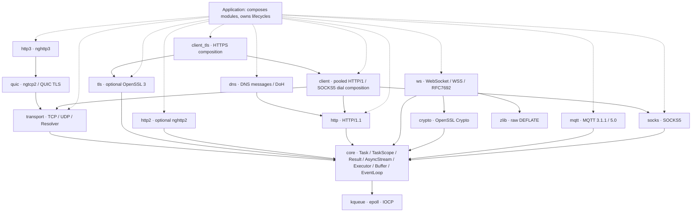

<div align="center">

# 🌐 Mira

**Coroutine-native C++23 networking · transport first, protocols on top** · TCP / UDP / TLS / WebSocket / HTTP/1.1 / HTTP/2 / QUIC / HTTP/3 / SOCKS5 / DoH / MQTT

One completion-shaped I/O API across kqueue, epoll, and IOCP — so protocols never have to know about sockets.

[](https://en.cppreference.com/w/cpp/23)
[](LICENSE)
[](https://github.com/dqsjqian/Mira/actions/workflows/ci.yml)
[](https://github.com/dqsjqian/Mira/releases/latest)
[](#-platform-matrix)

[简体中文](README.md) | English

</div>

---

> *Mira* — the foundation layer for network software, carrying every protocol and every business above it; not another HTTP framework that does everything.

**One completion-shaped I/O API across kqueue / epoll / IOCP; TCP-to-HTTP/3 evidence recorded by revision and configuration. C++23 is the baseline, not the selling point — coroutines, `std::expected`, and `stop_token` are first-class citizens.**

This page describes its source revision. The [version and release guide](docs/RELEASES.md) is the shared reference for the source version, compatibility policy and release consumption. Historical CI and current-revision acceptance are recorded separately.

## 🚀 Mira in 30 seconds

A TCP echo is the whole worldview: **you await a completion, the library owns the platform differences.**

```cpp
Mira::Task<Mira::Result<void>>
echo_tcp(Mira::transport::tcp::Socket& socket) {
    std::array<std::byte, 4096> buffer{};
    for (;;) {
        auto read = co_await socket.read_some(buffer);   // same shape on kqueue/epoll/IOCP
        if (!read) {
            if (read.error() == Mira::Errc::eof) co_return Mira::Result<void>{};
            co_return Mira::fail(read.error());
        }
        auto written = co_await Mira::write_all(
            socket, std::span<const std::byte>{buffer}.first(*read));
        if (!written) co_return Mira::fail(written.error());
    }
}
```

HTTP looks the same — the handler is a template free function, and **switching to a TLS stream changes nothing**:

```cpp
template<Mira::AsyncStream Stream>
Mira::Task<Mira::Result<void>> hello(
    const Mira::http::Request&,
    Mira::http::ResponseWriter<Stream>& writer,
    std::span<const std::byte>) {
    Mira::http::Response response;
    response.status = 200;
    response.headers.append("Content-Type", "text/plain; charset=utf-8");
    std::string_view body = "hello, Mira\n";
    co_return co_await writer.send(response, {
        reinterpret_cast<const std::byte*>(body.data()), body.size()});
}

// TCP:  co_await Mira::http::serve_connection(socket, &hello<tcp::Socket>);
// TLS:  co_await Mira::http::serve_connection(tls_stream, &hello<tls::Stream<tcp::Socket>>);
```

## 🎯 Why Mira

| Design choice | In one line |
|---|---|
| **A networking library, not a compatibility layer** | Independently designed; aims to be compatible with neither existing HTTP libraries nor host frameworks |
| **Wait for completion, not readiness** | `co_await read_some(buffer)` returns the outcome; readiness/completion platform gaps stay in the backend |
| **Compose, don't bind** | Protocols rely on `AsyncStream`; TLS does not hardcode HTTP, HTTP does not depend on OpenSSL |
| **Say what errors and limits mean** | `Result<T>` = `std::expected<T, std::error_code>`; cancellation, deadlines, and resource bounds are design standards |

Quality is not defined by feature counts or unmeasured benchmarks. Lifecycle, cross-platform semantics, and protocol correctness come first.

## 🏗 Module architecture



Solid arrows are dependency directions; dashed arrows are application-level composition. HTTP and TLS work through core's stream contract and **never depend on the TCP module directly**: HTTP → TLS → TCP composes at runtime, and so does a custom stream protocol over TCP.

| Module | Responsibility |
|---|---|
| `Mira::core` | Coroutines/scopes, stream/executor contracts, bounded posting, independent-thread `LoopGroup`, shared resource budgets |
| `Mira::transport` | TCP/UDP, local streams, bounded system resolver, interleaved-candidate `tcp::dial`, managed serving |
| `Mira::tls` | Same-loop duplex TLS streams, per-request deadlines, certificate/hostname verification, mTLS and ALPN |
| `Mira::ws` / `Mira::crypto` | WebSocket/WSS, subprotocols, bounded RFC7692 compression, secure nonce/masking, Extended CONNECT field negotiation |
| `Mira::http` | HTTP/1 parsing, serialization, per-connection serving, streaming requests/responses, duplex `Expect: 100-continue` exchange; depends only on stream contracts |
| `Mira::client` / `Mira::client_tls` | HTTP/1 / HTTPS pools and SOCKS5 composition; optional `client_http2` / `client_http3` own multiplexed connections with explicit close/join |
| `Mira::http2` | Optional nghttp2 session, multi-stream, Extended CONNECT and `ConnectStream` |
| `Mira::quic` / `Mira::http3` | QUIC v1, explicit migration/resumption, nghttp3/QPACK, Extended CONNECT, HTTP/3 0-RTT (SETTINGS-bound ticket domains) |
| `Mira::socks` | SOCKS5 (RFC 1928/1929) client and proxy handshakes with exact-length reads over any bounded stream |
| `Mira::dns` | DNS message codec (RFC 1035/6891, EDNS(0)) and DoH mapping (RFC 8484) |
| `Mira::mqtt` | MQTT 3.1.1/5.0 codec for every packet, socket-free client `Session`, duplex `Client<Stream>` |

Layering is enforced by `tools/ci/check_layering.py`: no reverse dependencies, no host-framework headers, platform detection centralized in `platform.hpp`, and no OS headers inside protocol modules.

## 📖 API tour

<details>
<summary><b>TaskScope: structured concurrency with explicit lifecycles</b></summary>

```cpp
Mira::Task<int> count_after_delay(Mira::EventLoop& loop) {
    int count = 0;
    Mira::TaskScope scope;
    scope.spawn(delayed_increment(loop, scope.get_stop_token(), count));
    co_await scope.join();          // returns only after every child frame is gone
    co_return count;                // count lives in this frame — no dangling
}
```

- `join()` may be called once; calling it closes admission. The first child exception triggers `request_stop()`; join rethrows after collecting everyone.
- Destroying a used-but-unjoined scope is `std::terminate()` — fail-fast, not implicit cleanup.
- Awaiting an empty `Task` throws `std::logic_error`; spawning one throws `std::invalid_argument`.
- Loops awaiting inline-completing tasks use constant native stack, including GCC Debug; an atomic rendezvous synchronizes completion and parent resumption when a task switches threads.
</details>

<details>
<summary><b>Cancellation and deadlines: a budget per operation</b></summary>

```cpp
co_return co_await loop.read(handle, into,
    {.stop    = std::move(stop),
     .deadline = Mira::EventLoop::Clock::now() + 5s});
```

| Situation | Outcome |
|---|---|
| Token already stopped at submission | `Errc::cancelled`, nothing submitted |
| Deadline already passed at submission | `Errc::timed_out`, nothing submitted |
| Both hit at once | `cancelled` — an explicit request outranks an elapsed budget |
| Real completion and cancellation in the same batch | The real completion wins |

**Absolute time points, not durations**: `tls::Stream` manages `{.deadline = T}` with an independent event-loop timer for each request. The entire handshake or individual read/write shares that absolute deadline. Underlying ciphertext I/O carries no request deadline and is never cancelled and replayed merely to update a deadline. Expiry or cancellation invalidates the TLS session, wakes the other direction and drains associated operations before returning. Cancellation never rolls back I/O; an IOCP cancelled read can discard bytes already moved by the kernel, so that connection cannot be reused.
</details>

<details>
<summary><b>TLS: verification, ALPN, and mTLS</b></summary>

```cpp
// Server: cert + key, optional mandatory client verification (mTLS), min version
auto ctx = Mira::tls::Context::server({
    .cert_file = "server.pem", .key_file = "server-key.pem",
    .client_ca_file = "ca.pem",      // non-empty = enforce mTLS
    .min_version = "1.2",            // "1.2" / "1.3"
});

// Client: chain + hostname verification; optional client certificate
auto client = Mira::tls::Context::client({
    .ca_file = "ca.pem", .cert_file = "client.pem", .key_file = "client-key.pem",
});
```

- `tls::Stream<T>::create(loop, transport, ctx, "localhost")` → `co_await stream.handshake()` → normal reads/writes
- No insecure verification bypass exists; TLS 1.0/1.1 are always refused
- After ALPN you must inspect `negotiated_protocol()` and pick H1/H2 yourself — the library never switches protocols implicitly
</details>

<details open>
<summary><b>HTTP: two windows, not one deadline</b></summary>

`ServerOptions` takes `idle_timeout` (silence between requests) and `request_timeout` (first byte to last response byte); `serve_connection` converts them into a fresh absolute deadline each round — request #100 on a keep-alive connection gets the same budget as request #1.

| Expiry of | Outcome |
|---|---|
| Idle window between requests | **Success** — closing a quiet keep-alive connection is its normal ending |
| Request window mid-exchange | `Errc::timed_out`, connection closed |

No 408 is sent: announcing it would require a second budget the caller never granted. Both windows default to off; internet-exposed services should set them explicitly.
</details>

## 📋 Platform matrix

| Platform | Backend | Verification |
|---|---|---|
| macOS | kqueue | Base/TLS/H2/H3 runtime tests, ASan/UBSan, independent HTTP/3 curl and Retry interoperability |
| Linux | epoll | GCC/Clang runtime tests, GCC ASan/UBSan, independent HTTP/3 curl and Retry interoperability |
| Windows | IOCP | Native MSVC/MinGW base/TLS/H2/H3 tests; MSVC independent HTTP/3 curl and Retry interoperability |
| iOS | kqueue | Host smoke and unsigned cross-build passed; no device run without a signing profile |
| Android | epoll | Non-TLS module cross-build, **NDK 29+**; no device-runtime evidence |

CI also covers installed packages and dependency isolation, protocol fuzzing, MQTT/mosquitto interoperability, and official Autobahn client/server tests including compression. The Linux, macOS and Windows MSVC protocol jobs require independent HTTP/3 and Retry interoperability. Configurations without an independent HTTP3 curl, such as the sanitizer jobs, count the corresponding cases as skipped.

Each [Release](https://github.com/dqsjqian/Mira/releases) links CI evidence and its source checksum. Repair and validation snapshots are kept in the [audit record](docs/AUDIT-2026-09-30.md); the CI badge above tracks main. LeakSanitizer was not run on macOS, and cross-builds do not establish mobile-device execution.

## ✨ Capability overview

| Area | Capabilities |
|---|---|
| Execution & lifecycle | Lazy `Task`, `TaskScope` join, reliable continuation posting, bounded application posting, independent-thread `LoopGroup` |
| Cancellation & deadlines | `OperationOptions` flows through `EventLoop` → TCP → TLS → HTTP |
| TCP | IPv4/IPv6, interleaved-candidate `dial`, short I/O, exclusive bind, grace drain / cancel / join |
| UDP | IPv4/IPv6, whole-datagram semantics, cancellation/deadlines, ASM multicast; POSIX packet metadata and per-packet source selection, explicit rejection of unsupported options |
| DNS | Bounded system resolution, policy caches and in-flight coalescing, independent cancellation; asynchronous UDP/TCP wire queries and DoH GET/POST/multiplexed mapping |
| TLS | OpenSSL 3, chain/DNS/IP verification, combined mTLS/multi-ALPN, SNI identity routing and atomic configuration reload, local CRL, close_notify |
| WebSocket/WSS | Subprotocols, fragmented/control frames, UTF-8, optional permessage-deflate, same-loop TCP/TLS duplex |
| Local transport / SSE | POSIX Unix-domain sockets; HTTP/1 chunked SSE and Last-Event-ID example |
| HTTP/1 | Incremental parsing, keep-alive, HEAD, chunked, streaming uploads/responses, `Expect: 100-continue` and duplex early responses, separate HTTP/HTTPS pool composition |
| HTTP/2 | nghttp2, HPACK, multi-stream, consumption-driven windows, explicit Extended CONNECT |
| QUIC/H3 | ngtcp2 + nghttp3 + OpenSSL ossl; validated migration, QUIC resumption/explicit 0-RTT, HTTP/3 0-RTT (0.5-RTT answers, same-stream-ID resubmission after rejection, automatic 425 for unsafe methods), QPACK, Extended CONNECT, two-phase GOAWAY |
| SOCKS5 | CONNECT, two-reply BIND, UDP ASSOCIATE and bounded unfragmented UDP framing; username/password, exact handshake reads, no local resolution of target domains |
| MQTT | 3.1.1 / 5.0, QoS 0/1/2 in both directions, CONNACK limits, topic aliases, keep-alive supervision, enhanced authentication, resumption resend |
| Safety & resources | Protocol limits, bounded TLS BIO, cross-loop budgets, optional early-data replay store, operation observation/metrics and QUIC qlog; not a process-RSS cap |

`stop()` only asks `run()` to return; per-operation cancellation is `OperationOptions`' job — every layer owns exactly one responsibility.

The [audit record](docs/AUDIT-2026-09-30.md) covers protocol resource budgets,
cancellation, task-lifetime repairs and their validation boundaries.

Use security-patched OpenSSL packages in production. As of 2026-09-30, the 3.5
LTS patch is **3.5.9** and the 3.6 patch is **3.6.5**; vendor packages with the
corresponding backported fixes are also suitable. Meeting the API minimum alone
does not establish patch status. In particular,
[CVE-2026-35189](https://openssl-library.org/news/vulnerabilities/#CVE-2026-35189)
can be reached through peer TLS certificates. Source-built CI now pins and
hash-verifies 3.5.9.

## 🚀 Quick start

Requires **CMake 3.21+ and a C++23 compiler**. CI toolchains include **GCC 14+ / Clang 19+ (Linux) / AppleClang / MSVC v143**:

- **GCC 14+**: GCC 13's coroutine optimizer has a known internal compiler error; fixed in GCC 14.
- **Clang 19+ on Linux**: clang-18 keeps `__cpp_concepts` outdated, so libstdc++ hides `std::expected` behind its feature-test.

The base core / transport / HTTP/1 build has zero third-party dependencies. TLS, WebSocket, HTTP/2 and QUIC/HTTP/3 dependencies are introduced only when those optional modules are enabled.

```bash
git clone https://github.com/dqsjqian/Mira.git
cd Mira
cmake -S . -B build/debug -DCMAKE_BUILD_TYPE=Debug
cmake --build build/debug -j
ctest --test-dir build/debug --output-on-failure
```

With TLS (needs OpenSSL 3):

```bash
cmake -S . -B build/tls -DCMAKE_BUILD_TYPE=Debug -DMIRA_ENABLE_TLS=ON
cmake --build build/tls -j && ctest --test-dir build/tls --output-on-failure
```

Optional higher protocols: `MIRA_ENABLE_HTTP2=ON` / `MIRA_ENABLE_HTTP3=ON` (off by default, never auto-downloads; dependency versions are SHA256-pinned via `tools/ci/build_protocol_deps.py`).

### Minimal client / server pairs

Start each server in terminal A, then its client in terminal B. All examples use loopback, deadlines, nonzero failure exits and response verification.

| Protocol | Terminal A: server | Terminal B: client |
|---|---|---|
| TCP echo | `build/debug/mira_echo_server 8080` | `build/debug/mira_tcp_client 8080 hello` |
| UDP echo | `build/debug/mira_udp_server 8081` | `build/debug/mira_udp_client 8081 hello` |
| HTTP/1.1 | `build/debug/mira_hello_world_server 8082` | `build/debug/mira_http1_client 8082` |
| HTTP/2 prior knowledge | `build/protocols/mira_h2_prior_knowledge_server 8083` | `build/protocols/mira_h2_client 8083` |
| HTTP/3 | `build/protocols/mira_h3_server 8443 cert.pem key.pem` | `build/protocols/mira_h3_client 8443 cert.pem` |

Pass `""` to the UDP client for a zero-byte datagram. H1 makes two keep-alive requests; H2/H3 submit two distinct streams. H2 uses cleartext prior knowledge, not TLS/ALPN. H3 serves multiple requests on one connection: it is not a multi-client CID-routing listener. Callers own production certificates and private keys.

Build H2/H3 after installing OpenSSL 3.5+ and setting `OPENSSL_ROOT_DIR`:

```bash
python3 tools/ci/build_protocol_deps.py --openssl-root "$OPENSSL_ROOT_DIR"
cmake -S . -B build/protocols -DMIRA_ENABLE_TLS=ON -DMIRA_ENABLE_HTTP2=ON -DMIRA_ENABLE_HTTP3=ON -DCMAKE_PREFIX_PATH="$PWD/build/protocol-deps/prefix" -DOPENSSL_ROOT_DIR="$OPENSSL_ROOT_DIR"
cmake --build build/protocols -j
ctest --test-dir build/protocols --output-on-failure
"$OPENSSL_ROOT_DIR/bin/openssl" req -x509 -newkey rsa:2048 -nodes -keyout key.pem -out cert.pem -days 2 -subj /CN=localhost -addext subjectAltName=DNS:localhost
```

The final command creates a local demonstration certificate only. The client verifies that CA and `localhost`; verification is never disabled. H3 can be enabled independently of H2/nghttp2. All pairs have out-of-process smoke tests; independent curl interoperability is tracked separately from Mira-to-Mira testing.

### 📦 Using it in your project

The [version and release guide](docs/RELEASES.md) centralizes version policy and the SHA256-pinned archive example. Read documentation at the selected release tag.

Add an already verified and extracted source tree to your build:

```cmake
set(MIRA_BUILD_TESTS OFF)
set(MIRA_BUILD_EXAMPLES OFF)
add_subdirectory(vendor/Mira)
target_link_libraries(my_app PRIVATE Mira::transport Mira::http)
# TLS: also set(MIRA_ENABLE_TLS ON) and link Mira::tls
```

Installed consumers use `find_package(Mira REQUIRED COMPONENTS core transport http)`; add the `tls` component for TLS. Keep the exact dependency version in the consuming application's lock file, as described in the shared guide.

Owning-client composition uses `find_package(Mira REQUIRED COMPONENTS client)` / `Mira::client`; HTTPS uses `client_tls` / `Mira::client_tls` and requires `MIRA_ENABLE_TLS=ON` when building. The base `client` target does not introduce OpenSSL; `http` itself still does not depend on transport. Protocol components `socks`, `dns` and `mqtt` map to `Mira::socks`, `Mira::dns` and `Mira::mqtt`; none introduces OpenSSL, and TLS is composed by the caller.

Android requires **NDK 29 or newer**: NDK 27/28's libc++ gates `std::stop_token` off; NDK 29 (clang 21) builds on API 24 as tested.

## Production composition now available

- **Single-port multi-client QUIC/H3**: `quic::Dispatcher` routes actual DCIDs, including newly issued IDs; `http3::make_server` composes H3. Admission, payload and queue reservations are bounded. Default `fixed_peer` rejects changed sources; explicit `MigrationPolicy::validated` permits migration/NAT rebinding only through path validation. Dispatchers can share `ResourceBudget`. Termination releases application budgets while retaining all issued CIDs for at least three PTOs. Local closes retransmit on matching input with bounded pacing; peer draining is silent. Closing slots are reserved at admission, never evicted early; explicit `remove()` purges protection. These are accounting limits, not a hard RSS cap or complete replay/flood protection.
- **QUIC Retry / source-address validation**: pass `RetryOptions{.policy = RetryPolicy::required}` to `http3::make_server` / `quic::Listener::create`. No connection or admission budget is allocated before token verification. Tokens use ngtcp2's AEAD, binding peer address/port, version, Retry CID, service scope and local endpoint. Expired, future, tampered or changed-source tokens are dropped silently. Keys default to instance-random and can be rotated with one previous key retained. Send or discard `ingest().reply` immediately; there is no internal Retry queue. The default limit is 128 replies per listener per fixed one-second window; adjacent windows can permit a burst of 256. This is not a sliding-second bound, full DDoS protection or one-time/replay protection. The policy defaults to disabled; public endpoints must explicitly select required. Shared keys require matching scope, local endpoint, ALPN and monotonic clock epoch.
- **Streaming H2/H3 output**: `request_stream` / `respond_stream` → `write_body` → `finish_body`. Exhaustion returns `would_block` without failing the connection. H3 chunks survive until ACK; QUIC bidirectional streams rotate to prevent starvation.
- **Connection lifecycle**: `client::HttpClient` / `HttpsClient` compose resolution, `tcp::dial` and bounded per-origin pools; client instances and fixed TLS configurations remain isolated. `Session::recycle()` requires a fully drained reusable response and no retained session tasks, otherwise it fails. Destruction discards by default; business requests are never replayed automatically, and `tcp::connect_with_retry` retries establishment only. `tcp::serve(loop, ...)` stops admission and closes the listener, allows a `grace_period` drain, then cooperatively cancels and joins. Grace bounds when cancellation is requested, not when an uncooperative handler returns.
- **WebSocket/WSS**: `MIRA_ENABLE_WEBSOCKET=ON` builds `Mira::ws` with OpenSSL Crypto-backed nonce/masking/RFC6455 handshake support and zlib. Fragmentation, incremental UTF-8, ping/pong/close, limits and independent peers are tested. TCP and TLS/WSS support one concurrent read and write on the same event loop; handshake/shutdown remain exclusive. Each TLS request owns its deadline timer. Cancellation/timeouts permanently invalidate the session and wake its companion, never replay ciphertext after cancellation. `Stream::create` takes the event loop explicitly; `close()` stops the wrapper without owning the transport. Optional subprotocol negotiation and permessage-deflate also compose over explicitly negotiated H2/H3 Extended CONNECT. Tunnel adapters have a different concurrency contract from TCP/TLS duplex, detailed below.
- **SSE / local streams**: `mira_sse_server` demonstrates chunked SSE, IDs and Last-Event-ID resume. `transport::local` provides POSIX filesystem Unix-domain streams; Windows explicitly returns `not_supported`. Caller-owned paths are never automatically removed.
- **HTTP/3 0-RTT**: both ends opt in with `EarlyDataPolicy::replay_safe`. A client holding a ticket is `early_ready()` at creation and sends GET/HEAD/OPTIONS whole-body requests in 0-RTT; a server that accepts answers in 0.5-RTT before the handshake completes, measured as one round trip. When the server rejects, TLS guarantees it processed no early data, and the engine resubmits the safe requests in order on the same stream IDs, so callers see one normal response. Early requests are flagged `early_data` on their event; unsafe methods are answered `425 Too Early` by the engine and never surfaced. `early_data_context` binds each ticket domain to the server's SETTINGS, and a server with different SETTINGS cannot be created. There is no anti-replay store; see below.
- **HTTP/1 `Expect: 100-continue` and duplex uploads**: `ClientConnection::exchange` uploads while reading 1xx/final responses. It waits for 100, a final response or `continue_timeout`; a >= 300 or closing response mid-upload withholds the rest of the body, while an early 2xx that keeps the connection lets the upload finish. An in-flight write is never cancelled for an early response (on TLS that would destroy the session). The server answers 100 eagerly for buffered handlers and on first read for streaming ones, closes instead of draining a refused body, and answers unknown expectations with 417.
- **SOCKS5 / DoH**: `Mira::socks` gives CONNECT clients and proxies RFC 1929 authentication and strict address handling, and `client::dial_via_socks5` spans dial and handshake with one deadline. `Mira::dns` decodes DNS messages treating every byte as hostile, maps DoH GET/POST in both directions, and `doh::query` runs over HTTP/1 on TLS. The examples interoperate with curl and independent Python peers.
- **MQTT 3.1.1 / 5.0**: the codec covers all fifteen packet types in both roles and never emits bytes its own decoder would reject. The socket-free `Session` implements QoS 1/2 in both directions, CONNACK limits, inbound topic aliases, PINGRESP supervision, enhanced authentication and ordered resumption resend. `Client<Stream>` borrows the caller's stream, runs one reader beside serialized writers, and makes `keep_alive(loop)` a timer-driven writer instead of relying on read timeouts that would destroy a TLS session. `mira_mqtt_client` interoperates with an independent Python broker and mosquitto; CI requires the mosquitto cases and fuzzes the codec.

```bash
cmake -S . -B build/ws -DMIRA_ENABLE_WEBSOCKET=ON -DMIRA_ENABLE_TLS=ON
cmake --build build/ws -j
ctest --test-dir build/ws --output-on-failure
# Two terminals: mira_ws_server 8080 / mira_ws_client 8080
# SSE: mira_sse_server 8081; client GET /events
# Multi-client H3 + Retry: mira_h3_multi_server cert.pem key.pem 8443 --retry
# SOCKS5: mira_socks5_server 1080 / mira_socks5_client 1080 example.com 80
# DoH: mira_doh_client 1.1.1.1 443 example.com AAAA
# MQTT (local mosquitto -p 1883): mira_mqtt_client 127.0.0.1 1883 echo mira/demo hello --qos 2
```

Real network benchmark: `python3 tools/bench/network_bench.py --server build/release/mira_managed_echo_server --clients 8 --requests 1000 --slow-clients 4` emits throughput, p50/p99, sampled peak RSS and environment JSON. The independent Python socket load generator uses loopback; these are neither cross-library rankings nor WAN measurements.

### Additional production composition (main, not separately released)

- **Concurrent H2/H3**: `SessionDriver` owns independent read/write tasks and QUIC expiry processing; `ClientSession` provides bounded concurrent requests. Owning per-origin `client::Http2Client` / `Http3Client` pools are consumed through `Mira::client_http2` / `client_http3`; H2 strictly requires ALPN=h2 and H3 uses fixed-peer 1-RTT setup. They never automatically replay a business request. `client::Http2Client` / `Http3Client` own per-origin transport/security/session objects, coalesce connection establishment and enforce `max_origins` / `max_active`; link `Mira::client_http2` / `Mira::client_http3`. No implicit protocol downgrade or business-request replay. Per-stream cancellation does not cancel shared TLS reads. `ConnectStream` with this driver allows one read and one write concurrently; legacy custom drivers retain exclusive operation semantics. Finish business tasks, then stop/join before destruction.
- **TLS**: exact SNI identity routing, mTLS plus multi-ALPN configuration, and atomic `reload_server` snapshots. Ticket scopes are isolated per identity and configuration generation. Local CRLs, OCSP stapling and explicit client validation require no online fetching. OpenSSL default trust is not native Keychain/Windows policy.
- **DNS/UDP**: bounded resolver policy caching and in-flight coalescing; `dns::query_udp/query_tcp` perform explicit, thread-free dedicated-connection queries. TCP fallback remains caller composition. UDP adds ASM multicast and POSIX ancillary/source selection; nonempty Windows ancillary options fail explicitly.
- **QUIC**: configurable PMTUD, UDP ceiling and Cubic/Reno/BBR; RFC 9221 DATAGRAMs (not H3 DATAGRAM/WebTransport), bounded lossy receive queues, qlog and statistics. Optional atomic `ReplayStore` admission has an in-process bounded implementation that never evicts live entries; all ticket-domain users must share it. It is not a distributed or restart-persistent store.
- **Protocol composition**: `ws::ByteStream` carries MQTT and other binary-stream protocols. MQTT checkpoint/restore binds version, client ID and caller scope, with expiry handling; atomic disk storage and business transactions remain application responsibilities. SOCKS5 adds two-reply BIND, UDP ASSOCIATE and strict UDP framing without fragmentation. `dns::doh::query_multiplexed` composes with H2/H3 clients.
- **Observability**: `observe`, `ObservedStream` and fixed-size `OperationMetrics` expose correlation, outcomes, latency and bytes without payload/credential collection or a mandatory telemetry vendor.

Independent aioquic-client to Mira-server loopback checks cover authenticated H3, accepted/rejected early data and WebSocket Extended CONNECT. Reproduce with `tools/ci/check_h3_aioquic.py`. A 30-minute, 16-client fault-soak snapshot completed 116,480/116,480 requests, 87,360 short streams during slow-response overlap, and zero final resource counters. This evidence is configuration-specific, not WAN certification or a universal performance ranking.

### Main-branch API boundaries

- **QUIC paths and early data**: validated mode requires path-aware `receive` plus `poll_datagram` / `close_datagram`. Clients call `initiate_migration()`; applications retain both paths during validation and send on the returned path. A CID match is not address validation. The bounded in-memory `SessionCache` limits entries, bytes, ticket size and lifetime; `ServerContext` explicitly shares the server ticket domain. Ordinary `open_stream` / `write` never send early data. Only `EarlyDataPolicy::replay_safe` plus `open_early_stream` / `write_early` attempt raw QUIC 0-RTT. Callers must make operations replay-safe. Default early data has no anti-replay guarantee; explicit shared `ReplayStore` scope is described below. The raw QUIC layer never replays rejected data automatically. HTTP/3 0-RTT has its own contract, described below.
- **Dialing and uploads**: `tcp::dial` deduplicates resolved endpoints, interleaves IPv4/IPv6 and staggers bounded concurrent attempts within one deadline; losers are cancelled and joined before return. System `getaddrinfo` still runs in bounded workers, not independent asynchronous A/AAAA queries. HTTP/1 `begin` → `send_body` → `finish` supports content-length/chunked uploads, per-chunk backpressure and one budget covering upload, producer pauses and response. That trio is **send-first**; for `Expect: 100-continue` or reading an early response during the upload use the duplex `exchange`, which needs a stream allowing one read and one write in flight (Mira TCP/TLS/local streams do). A peer that neither reads nor closes is still bounded by the deadline or stop.
- **Execution and budgets**: `EventLoop::post` remains the reliable continuation channel. Application admission uses `try_post` / `BoundedExecutor`, returning `would_block` on saturation; the latter deliberately does not satisfy `Executor`. Posting quotas end before invocation and do not bound asynchronous work created by callbacks. `LoopGroup` owns an independent thread-affine loop per worker, bounding queued and unfinished root tasks. Create/use sockets on their worker; do not transfer attached sockets. Shared `ResourceBudget` is accounting, not a bound on all allocator/third-party state or process RSS.
- **Managed TLS example**: enable TLS/H2 and run `build/protocols/mira_https_managed_server cert.pem key.pem 8444 64 16 5000 1000 1000`. It separately bounds connections/handshakes, sets handshake deadlines, dispatches negotiated ALPN to H1/H2, rejects missing/unknown ALPN and demonstrates grace drain / cancel / join. Each connection serves one H1 request or one H2 batch, not a general production server.

QUIC resumption and 0-RTT require an explicit `ca_file`. Cache keys bind the trust material actually loaded by OpenSSL (certificates, AUX trusted/rejected purposes and CRLs), so replacing a CA or its trust attributes at the same path cannot reuse an old ticket. The fingerprint comes from the loaded store, not a second path read. With an empty `ca_file`, default system trust may include lazy sources: no tickets are stored or resumed, and each connection performs a full authenticated handshake. File changes do not retroactively revoke existing connections.

### H2/H3 Extended CONNECT

Explicitly set `enable_connect_protocol = true` in `http2::Limits` / `http3::Limits`. Clients wait for actual peer `SETTINGS_ENABLE_CONNECT_PROTOCOL`, then use `request_stream` with `:method = CONNECT`, `:protocol`, `:scheme`, `:authority` and `:path`. Servers accept through `respond_stream`; only successful 2xx responses establish tunnels. **204 returns `not_supported`** because the pinned engines treat it as bodyless. Ordinary CONNECT proxying is outside this capability.

`http2::ConnectStream<Driver>` / `http3::ConnectStream<Driver>` borrow accepted streams. Driver `progress(OperationOptions)` / `flush(OperationOptions)` must serialize connection driving and honor cancellation/deadlines. **The built-in `http2::SessionDriver` / `http3::SessionDriver` permit one read and one write concurrently**, using independent reader/writer tasks and QUIC timers. Stream-local cancellation does not cancel shared TLS input. Legacy custom drivers retain the one-operation contract. Engines, transports and drivers must outlive application tasks and `join()`; never mix direct body operations. `finish()` half-closes local output; `close()`/cancellation resets only that stream, without promising driver-level connection failures stay stream-local.

WebSocket uses `extended_connect_request` / `accept_extended_connect` / `validate_extended_connect` to validate fields and negotiate subprotocols/PMD, then passes `Negotiated` to `Connection::adopt_extended_connect`. No HTTP/1 Upgrade or nonce handshake runs. The latest `ws.connect_network` run passed four scenarios: TCP H2 / UDP H3 × compression off/on. This is same-library real-network evidence. The first-Initial-flight drop setting was removed, so it is not PTO recovery evidence. Separately, `tools/ci/check_h3_aioquic.py` uses a different QUIC/TLS/QPACK engine to validate H3, accepted/rejected early-data fallback and WebSocket Extended CONNECT binary/ping/close. Its scope is aioquic client to Mira server, not reverse-direction or all-implementation certification.

### WebSocket subprotocols and compression

Pass `HandshakeOptions` as the fourth `ws::Connection` constructor argument. `subprotocols` is an ordered protocol list; the server chooses a shared value in server preference order. `require_subprotocol` requires agreement. Read `subprotocol()` after the handshake. Names are case-sensitive; clients reject unoffered protocols, multiple selections and duplicate response headers.

Only `compression.enabled = true` offers/accepts RFC7692 permessage-deflate; it defaults off. Both directions support context takeover, no-context-takeover, window negotiation, compressed fragments and interleaved controls. `read_frame` / `read_message` return plaintext, with incremental UTF-8 validation after decompression. `Limits::max_frame` bounds both the wire frame and that frame's decoded output; `max_message` independently bounds accumulated compressed and plaintext bytes. Sending supports window bits 9–15 and receiving 8–15; zlib cannot reliably encode an 8-bit window, so negotiation never claims it. Directional contexts are independent and cannot be reused after failure.

`compression_parameters()` returns the wire agreement; clients still locally honor stricter window and no-context hints promised in their offer. Compression introduces size side channels: do not mix secrets and attacker-controlled content in one compression context; leave compression off for sensitive data. Building ws requires zlib, but base-module and Crypto-only installed consumers do not discover it.

Independent Python socket/zlib interoperability: `python3 tools/ci/check_ws_interop.py --extensions-peer build/ws/mira_ws_extensions_peer`. Run official Autobahn client/server coverage including compression with `run_autobahn.py --compression`; CI rejects failures, NON-STRICT results and missing cases. INFORMATIONAL cases are counted separately. Revision-specific results and complete reports are linked from the [audit record](docs/AUDIT-2026-09-30.md).

### HTTP/3 0-RTT

```cpp
// Server: bind this end's H3 SETTINGS before creating the ServerContext.
Mira::http3::Limits limits;
server_options.service_scope = "api";
server_options.early_data = Mira::quic::EarlyDataPolicy::replay_safe;
server_options.early_data_context = Mira::http3::early_data_context(limits);
server_options.server_context = Mira::quic::ServerContext::create(server_options).value();

// Client: explicit ca_file and a shared SessionCache; with a ticket, connect returns before any datagram.
client_options.service_scope = "api";
client_options.session_cache = cache;
client_options.early_data = Mira::quic::EarlyDataPolicy::replay_safe;
auto h3 = co_await H3::connect(loop, client_options, limits, io);
auto get = co_await h3->request(get_fields);             // Safe method: sent in 0-RTT
auto post = co_await h3->request(post_fields, body, io); // Others: handshake first (bounded by io), then 1-RTT
```

The client does not remember server SETTINGS: early requests use defaults (QPACK dynamic table 0, no Extended CONNECT), which RFC 9114 section 7.2.4.2 permits and every compliant server accepts. Compatibility is decided on the server: `http3::Engine::create` / `make_server` refuse SETTINGS that differ from the ticket domain, and tickets from another `ServerContext` cannot be decrypted at all. Applications must still decide whether a safe-method request flagged `early_data` may run twice (RFC 8470: answer 425 if not). Without an explicit replay store, captured early flights may be replayed within the ticket domain. Configure `replay_store` before creating `ServerContext` to use `MemoryReplayStore`: bounded atomic admission shared across threads, rejecting duplicates, capacity exhaustion, clock rollback or storage failure without evicting live records. Cross-process deployments supply shared atomic storage and a common time base; never restore old ticket keys with an empty in-memory store after restart. This is not business-transaction exactly-once and does not change Retry-token semantics.

### MQTT

```cpp
Mira::mqtt::ClientOptions options;                        // 5.0 by default; options.version can select v311
options.client_id = "sensor-7";
options.keep_alive = 30;
auto client = co_await Mira::mqtt::Client<tcp::Socket>::connect(socket, options, io);
auto sub = co_await client->subscribe({{"sensors/+/temp", Mira::mqtt::QoS::at_least_once}});
auto granted = co_await client->wait_for(*sub);           // SUBACK; other events stay for receive
auto id = co_await client->publish("sensors/7/temp", payload, Mira::mqtt::QoS::exactly_once);
auto events = co_await client->receive();                 // messages, publish completions, server DISCONNECT...
// keep_alive(loop) is a timer-driven writer: run it beside receive on the same loop, safe over TLS
```

The caller owns the stream and destroys it after the client; the client never closes it. Exceeding the server's Receive Maximum, running out of packet identifiers or filling the output budget returns `would_block`; nothing is queued invisibly. Peer violations close the session with a 5.0 DISCONNECT carrying the reason. Received QoS 1 messages are acknowledged when surfaced. After a transport loss, `reconnect` on a new stream: with `clean_start = false` and a session the server still holds, unacknowledged PUBLISH (DUP) and PUBREL are resent in original order; otherwise they are reported as `discarded` events. `ws::ByteStream` adapts an already-negotiated binary WebSocket (`mqtt` subprotocol) into a bounded stream for `mqtt::Client`. Session and Client `checkpoint/restore` preserve QoS 1/2 in-flight state and incoming QoS 2 release identifiers, bound to caller-declared broker/tenant scope, client ID and protocol version. Client snapshots refuse undelivered events or pending I/O. Atomic storage, confidentiality and elapsed time belong to the caller; snapshots are not a write-ahead log or business exactly-once. A broker, outbound topic aliases and automatic reconnect policy remain out of scope.

### Real UDP Retry fault validation

Enable `MIRA_ENABLE_HTTP3=ON` and `MIRA_BUILD_BENCH=ON` to reproduce bounded loss, duplication, delay, reordering and connection churn:

```bash
python3 tools/bench/run_h3_soak.py --binary build/protocols/bench/bench_h3_soak \
  --duration-seconds 600 --seed 20260929 --output build/h3-soak.json
```

Each round verifies binary contents, newly submitted short streams progressing during slow responses, closing-slot admission and final budget drain; timeouts or mismatches fail with a nonzero exit. Defaults are 3 clients with 4 streams each, streaming 128 KiB large bodies through 16 KiB protocol buffers. A fixed seed selects fault decisions, not bit-identical timing or random CIDs. This is single-machine loopback sustained validation, not multi-host or long-term stability certification. Initial normal-close packets bypass fault injection; RSS is sampled, not capped. Keep the machine awake; sleep-induced timeouts still fail.

Recorded 600-second report `build/all-main/sustained-600.json`: 13,548/13,548 requests passed and 10,161/10,161 short streams completed during slow-response overlap; final connections, routes, tombstones, queued_bytes and reserved_payload_bytes were all zero. This is single-machine real-UDP loopback evidence, not multi-host/WAN coverage, certification of later source or a hard process-RSS cap.

## Next: remaining verification boundaries

1. iOS host smoke and unsigned cross-compilation passed, but device execution lacks a signing profile; Android has no device evidence. MinGW has H2/H3 and independent curl interoperability results, but that job does not build its own source-pinned curl; the strict Windows MSVC interoperability job does.
2. Longer fault injection, multi-host/WAN load and hard process-memory limits remain unverified. Single-machine loopback and bounded fuzz/soak runs do not establish that coverage.
3. aioquic-to-Mira H3 early-data acceptance/rejection and WebSocket Extended CONNECT now have independent-stack evidence. Reverse roles, more stacks and real WAN coverage remain open. The built-in replay store is shared in-process; no distributed durable backend ships. Retry tokens are not guaranteed single-use and the listener is not an Internet flood-protection system.
4. Remembered peer SETTINGS, native system trust, Windows UDP ancillary data, SSM multicast and automatic DNS fallback remain open. Select io_uring/kernel-zero-copy/custom allocators from measured bottlenecks, not a feature-name checklist. Keep gRPC/Redis/WebRTC in the ecosystem layer.

See the [architecture document](docs/ARCHITECTURE.md) for design rationale and acceptance criteria.

## 🤝 Contributing

Start from a reproducible problem, a crisp contract, or a targeted test. Keep module dependencies one-way, state ownership and platform differences, and run the relevant tests plus `tools/ci/check_layering.py`. Performance contributions need a reproducible environment and measurement method.

## 🙏 Acknowledgements

- [nghttp2](https://github.com/nghttp2/nghttp2) — HTTP/2 engine (optional)
- [ngtcp2](https://github.com/ngtcp2/ngtcp2) / [nghttp3](https://github.com/ngtcp2/nghttp3) — QUIC / HTTP/3 engines
- [OpenSSL](https://www.openssl.org/) — TLS 1.2/1.3 and QUIC TLS (optional)

## 📄 License

[MIT](LICENSE) © 2026 Mira contributors

MIT applies to Mira's own code; third-party components retain their licenses.
See [third-party notices](THIRD_PARTY_NOTICES.md) for dependencies, embedded
attributions and redistribution requirements.

---

<div align="center">

**📖 Other languages**

[简体中文](README.md)

</div>
