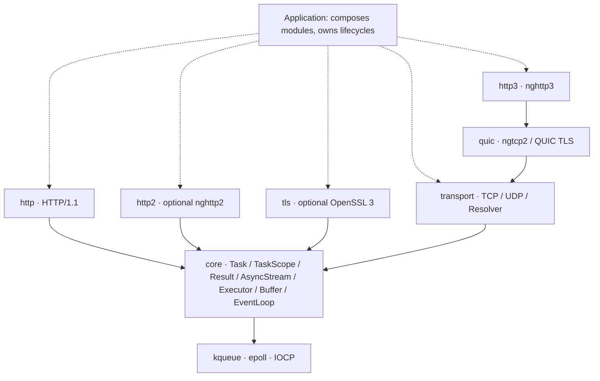

<div align="center">

# 🌐 Mira

**Coroutine-native C++23 networking · transport first, protocols on top** · TCP / UDP / TLS / HTTP/1.1 / HTTP/2 / QUIC / HTTP/3

One completion-shaped I/O API across kqueue, epoll, and IOCP — so protocols never have to know about sockets.

[](https://en.cppreference.com/w/cpp/23)
[](LICENSE)
[](https://github.com/dqsjqian/Mira/actions/workflows/ci.yml)
[](#-platform-matrix)

简体中文 | [English](README.en.md)

</div>

---

> *Mira* — the foundation layer for network software, carrying every protocol and every business above it; not another HTTP framework that does everything.

**One completion-shaped I/O API across kqueue / epoll / IOCP; the full stack from TCP to HTTP/3, proven. C++23 is the baseline, not the selling point — coroutines, `std::expected`, and `stop_token` are first-class citizens.**

## 🚀 Mira30 seconds

A TCP echo is the whole worldview: **you await a completion, the library owns the platform differences.**

```cpp
Mira::Task<Mira::Result<void>>
echo_tcp(Mira::transport::tcp::Socket& socket) {
    std::array<std::byte, 4096> buffer{};
    for (;;) {
        auto read = co_await socket.read_some(buffer);   // same shape on kqueue/epoll/IOCP
        if (!read) {
            if (read.error() == Mira::Errc::eof) co_return Mira::Result<void>{};
            co_return Mira::fail(read.error());
        }
        auto written = co_await Mira::write_all(
            socket, std::span<const std::byte>{buffer}.first(*read));
        if (!written) co_return Mira::fail(written.error());
    }
}
```

HTTP looks the same — the handler is a template free function, and **switching to a TLS stream changes nothing**:

```cpp
template<Mira::AsyncStream Stream>
Mira::Task<Mira::Result<void>> hello(
    const Mira::http::Request&,
    Mira::http::ResponseWriter<Stream>& writer,
    std::span<const std::byte>) {
    Mira::http::Response response;
    response.status = 200;
    response.headers.append("Content-Type", "text/plain; charset=utf-8");
    std::string_view body = "hello, Mira\n";
    co_return co_await writer.send(response, {
        reinterpret_cast<const std::byte*>(body.data()), body.size()});
}

// TCP:  co_await Mira::http::serve_connection(socket, &hello<tcp::Socket>);
// TLS:  co_await Mira::http::serve_connection(tls_stream, &hello<tls::Stream<tcp::Socket>>);
```

## 🎯 Why Mira

| Design choice | In one line |
|---|---|
| **A networking library, not a compatibility layer** | Independently designed; aims to be compatible with neither existing HTTP libraries nor host frameworks |
| **Wait for completion, not readiness** | `co_await read_some(buffer)` returns the outcome; readiness/completion platform gaps stay in the backend |
| **Compose, don't bind** | Protocols rely on `AsyncStream`; TLS does not hardcode HTTP, HTTP does not depend on OpenSSL |
| **Say what errors and limits mean** | `Result<T>` = `std::expected<T, std::error_code>`; cancellation, deadlines, and resource bounds are design standards |

Quality is not defined by feature counts or unmeasured benchmarks. Lifecycle, cross-platform semantics, and protocol correctness come first.

## 🏗 Module architecture



Solid arrows are dependency directions; dashed arrows are application-level composition. HTTP and TLS work through core's stream contract and **never depend on the TCP module directly**: HTTP → TLS → TCP composes at runtime, and so does a custom stream protocol over TCP.

| Module | Responsibility |
|---|---|
| `Mira::core` | Coroutines and task scopes, errors, stream and executor interfaces, buffers, event loop and timers |
| `Mira::transport` | IP endpoints, TCP (exclusive bind by default), message-boundary UDP, bounded background system resolver |
| `Mira::tls` | Optional TLS streams, certificate and hostname verification, mTLS client verification, multi-protocol ALPN |
| `Mira::http` | HTTP/1 request/response parsing, serialization, per-connection serving (incl. chunked streaming) and client |
| `Mira::http2` | Optional nghttp2 session, multi-stream state, generic stream adaptation |
| `Mira::quic` / `Mira::http3` | QUIC v1 and nghttp3 / QPACK engines |

Layering is enforced by `tools/ci/check_layering.py`: no reverse dependencies, no host-framework headers, platform detection centralized in `platform.hpp`, and no OS headers inside protocol modules.

## 📖 API tour

<details>
<summary><b>TaskScope: structured concurrency with explicit lifecycles</b></summary>

```cpp
Mira::Task<int> count_after_delay(Mira::EventLoop& loop) {
    int count = 0;
    Mira::TaskScope scope;
    scope.spawn(delayed_increment(loop, scope.get_stop_token(), count));
    co_await scope.join();          // returns only after every child frame is gone
    co_return count;                // count lives in this frame — no dangling
}
```

- `join()` may be called once; calling it closes admission. The first child exception triggers `request_stop()`; join rethrows after collecting everyone.
- Destroying a used-but-unjoined scope is `std::terminate()` — fail-fast, not implicit cleanup.
- Awaiting an empty `Task` throws `std::logic_error`; spawning one throws `std::invalid_argument`.
</details>

<details>
<summary><b>Cancellation and deadlines: a budget per operation</b></summary>

```cpp
co_return co_await loop.read(handle, into,
    {.stop    = std::move(stop),
     .deadline = Mira::EventLoop::Clock::now() + 5s});
```

| Situation | Outcome |
|---|---|
| Token already stopped at submission | `Errc::cancelled`, nothing submitted |
| Deadline already passed at submission | `Errc::timed_out`, nothing submitted |
| Both hit at once | `cancelled` — an explicit request outranks an elapsed budget |
| Real completion and cancellation in the same batch | The real completion wins |

**Absolute time points, not durations**: a `{.deadline = T}` handed to `tls::Stream` is forwarded to every underlying read/write, so "the whole handshake must finish by T" requires no subtraction in any layer. Cancellation never rolls back I/O that already happened; on IOCP a cancelled read may discard bytes the kernel already moved — that connection must be closed, not reused.
</details>

<details>
<summary><b>TLS: verification, ALPN, and mTLS</b></summary>

```cpp
// Server: cert + key, optional mandatory client verification (mTLS), min version
auto ctx = Mira::tls::Context::server({
    .cert_file = "server.pem", .key_file = "server-key.pem",
    .client_ca_file = "ca.pem",      // non-empty = enforce mTLS
    .min_version = "1.2",            // "1.2" / "1.3"
});

// Client: chain + hostname verification; optional client certificate
auto client = Mira::tls::Context::client({
    .ca_file = "ca.pem", .cert_file = "client.pem", .key_file = "client-key.pem",
});
```

- `tls::Stream<T>::create(loop, transport, ctx, "localhost")` → `co_await stream.handshake()` → normal reads/writes
- No insecure verification bypass exists; TLS 1.0/1.1 are always refused
- After ALPN you must inspect `negotiated_protocol()` and pick H1/H2 yourself — the library never switches protocols implicitly
</details>

<details open>
<summary><b>HTTP: two windows, not one deadline</b></summary>

`ServerOptions` takes `idle_timeout` (silence between requests) and `request_timeout` (first byte to last response byte); `serve_connection` converts them into a fresh absolute deadline each round — request #100 on a keep-alive connection gets the same budget as request #1.

| Expiry of | Outcome |
|---|---|
| Idle window between requests | **Success** — closing a quiet keep-alive connection is its normal ending |
| Request window mid-exchange | `Errc::timed_out`, connection closed |

No 408 is sent: announcing it would require a second budget the caller never granted. Both windows default to off; internet-exposed services should set them explicitly.
</details>

## 📋 Platform matrix

| Platform | Backend | Verification |
|---|---|---|
| macOS | kqueue | Desktop test runs, incl. TLS / HTTPS |
| Linux | epoll | Desktop CI, dedicated TLS matrix |
| Windows | IOCP | Desktop loopback CI, dedicated TLS matrix |
| iOS / Android | kqueue / epoll | Cross-compile core / transport / HTTP1; Android requires **NDK 29+** |

CI covers desktop base/TLS, MinGW, sanitizers, parser fuzzing and Linux/macOS H2/H3 runs. **Windows H2/H3 and mobile protocol runtime coverage are not yet verified**; mobile jobs cross-compile base non-TLS modules, not every protocol on real devices. The Linux protocol job builds a pinned HTTP/3 curl for mandatory independent interoperability; missing tooling cannot count as a pass. See the CI link above for the current run.

## ✨ Capability overview

| Area | Capabilities |
|---|---|
| Execution & lifecycle | Lazy, move-only `Task`; single-threaded `TaskScope` spawn/join with cooperative stop tokens; `EventLoop`, timers, posting |
| Cancellation & deadlines | `OperationOptions` flows through `EventLoop` → TCP → TLS → HTTP |
| TCP | IPv4/IPv6, listen, connect, short I/O, exclusive bind by default |
| UDP | IPv4/IPv6, zero-length datagrams, truncation errors, per-direction exclusivity |
| DNS | Bounded worker pool, system getaddrinfo, dedup, total deadline |
| TLS | OpenSSL 3, chain and DNS/IP verification, mTLS, multi-protocol ALPN, close_notify |
| HTTP/1 | Incremental parsing, keep-alive, HEAD, chunked, streaming responses, external cancellation |
| HTTP/2 | nghttp2 client/server, HPACK, multi-stream, consumption-driven windows |
| QUIC/H3 | ngtcp2 + nghttp3 + OpenSSL ossl; encrypted datagrams, QPACK, two-phase GOAWAY |
| Safety & resources | Protocol-level limits, malformed-input negative tests, bounded TLS BIO |

`stop()` only asks `run()` to return; per-operation cancellation is `OperationOptions`' job — every layer owns exactly one responsibility.

## 🚀 Quick start

Requires **CMake 3.20+ and a C++23 compiler**. Tested baseline: **GCC 14+ / Clang 19+ (Linux) / AppleClang / MSVC v143**, proven end to end:

- **GCC 14+**: GCC 13's coroutine optimizer has a known internal compiler error; fixed in GCC 14.
- **Clang 19+ on Linux**: clang-18 keeps `__cpp_concepts` outdated, so libstdc++ hides `std::expected` behind its feature-test.

Non-TLS builds have zero third-party dependencies.

```bash
git clone https://github.com/dqsjqian/Mira.git
cd Mira
cmake -S . -B build/debug -DCMAKE_BUILD_TYPE=Debug
cmake --build build/debug -j
ctest --test-dir build/debug --output-on-failure
```

With TLS (needs OpenSSL 3):

```bash
cmake -S . -B build/tls -DCMAKE_BUILD_TYPE=Debug -DMIRA_ENABLE_TLS=ON
cmake --build build/tls -j && ctest --test-dir build/tls --output-on-failure
```

Optional higher protocols: `MIRA_ENABLE_HTTP2=ON` / `MIRA_ENABLE_HTTP3=ON` (off by default, never auto-downloads; dependency versions are SHA256-pinned via `tools/ci/build_protocol_deps.py`).

### Minimal client / server pairs

Start each server in terminal A, then its client in terminal B. All examples use loopback, deadlines, nonzero failure exits and response verification.

| Protocol | Terminal A: server | Terminal B: client |
|---|---|---|
| TCP echo | `build/debug/mira_echo_server 8080` | `build/debug/mira_tcp_client 8080 hello` |
| UDP echo | `build/debug/mira_udp_server 8081` | `build/debug/mira_udp_client 8081 hello` |
| HTTP/1.1 | `build/debug/mira_hello_world_server 8082` | `build/debug/mira_http1_client 8082` |
| HTTP/2 prior knowledge | `build/protocols/mira_h2_prior_knowledge_server 8083` | `build/protocols/mira_h2_client 8083` |
| HTTP/3 | `build/protocols/mira_h3_server 8443 cert.pem key.pem` | `build/protocols/mira_h3_client 8443 cert.pem` |

Pass `""` to the UDP client for a zero-byte datagram. H1 makes two keep-alive requests; H2/H3 submit two distinct streams. H2 uses cleartext prior knowledge, not TLS/ALPN. H3 serves multiple requests on one connection: it is not a multi-client CID-routing listener. Callers own production certificates and private keys.

Build H2/H3 after installing OpenSSL 3.5+ and setting `OPENSSL_ROOT_DIR`:

```bash
python3 tools/ci/build_protocol_deps.py --openssl-root "$OPENSSL_ROOT_DIR"
cmake -S . -B build/protocols -DMIRA_ENABLE_TLS=ON -DMIRA_ENABLE_HTTP2=ON -DMIRA_ENABLE_HTTP3=ON -DCMAKE_PREFIX_PATH="$PWD/build/protocol-deps/prefix" -DOPENSSL_ROOT_DIR="$OPENSSL_ROOT_DIR"
cmake --build build/protocols -j
ctest --test-dir build/protocols --output-on-failure
"$OPENSSL_ROOT_DIR/bin/openssl" req -x509 -newkey rsa:2048 -nodes -keyout key.pem -out cert.pem -days 2 -subj /CN=localhost -addext subjectAltName=DNS:localhost
```

The final command creates a local demonstration certificate only. The client verifies that CA and `localhost`; verification is never disabled. H3 can be enabled independently of H2/nghttp2. All pairs have out-of-process smoke tests; independent curl interoperability is tracked separately from Mira-to-Mira testing.

### 📦 Using it in your project

The recommended pattern — the one Aria and AriaAgent use — is a **hash-pinned release archive**: every version ships a source tarball on GitHub Releases; download it, verify its SHA256, then `add_subdirectory` it. No submodules, no vendored trees, no configure-time network beyond the pinned fetch:

```cmake
include(ariaFetchPinned)  # or your repo's equivalent download + SHA256 primitive
aria_fetch_pinned_archive(
    NAME      Mira
    VERSION   0.4.0
    URL       "https://github.com/dqsjqian/Mira/releases/download/v0.4.0/Mira-0.4.0.tar.gz"
    SHA256    3290abda456d4897103f160e0905d09c5b29dfc973ec15024b8f76ce705dd856
)
set(MIRA_BUILD_TESTS OFF)
set(MIRA_BUILD_EXAMPLES OFF)
add_subdirectory(${ARIA_PINNED_MIRA_SOURCE_DIR} Mira)
target_link_libraries(my_app PRIVATE Mira::transport Mira::http)
# TLS: also set(MIRA_ENABLE_TLS ON) and additionally link Mira::tls
```

For local development, pointing at a source tree works too: `add_subdirectory(vendor/Mira)` (`MIRA_BUILD_TESTS` defaults off in subdirectory mode). Installed consumption uses `find_package(Mira REQUIRED COMPONENTS core transport http)`, add the `tls` component when needed.

Android requires **NDK 29 or newer**: NDK 27/28's libc++ gates `std::stop_token` off; NDK 29 (clang 21) builds on API 24 as tested.

## Production composition now available

- **Single-port multi-client QUIC/H3**: `quic::Dispatcher` routes actual DCIDs, including newly issued IDs; `http3::make_server` composes H3. Admission, payload and queue reservations are bounded, and dispatchers can share `ResourceBudget`. Termination releases application budgets while retaining all issued CIDs for at least three PTOs. Local closes retransmit on matching input with bounded pacing; peer draining is silent. Closing slots are reserved at admission, never evicted early; explicit `remove()` purges protection. These are accounting limits, not a hard RSS cap or complete replay/flood protection; peers remain fixed.
- **Streaming H2/H3 output**: `request_stream` / `respond_stream` → `write_body` → `finish_body`. Exhaustion returns `would_block` without failing the connection. H3 chunks survive until ACK; QUIC bidirectional streams rotate to prevent starvation.
- **Connection lifecycle**: `ConnectionPool<T>` provides bounded per-origin leases and idle eviction; leases discard by default and recycle only drained connections. `tcp::connect_with_retry` retries connection establishment, never application requests. `tcp::serve` bounds admission and cooperatively stops, cancels and joins handlers.
- **WebSocket/WSS**: `MIRA_ENABLE_WEBSOCKET=ON` builds `Mira::ws` and OpenSSL Crypto-backed nonce/masking/RFC6455 handshake support. Fragmentation, incremental UTF-8, ping/pong/close, limits and independent peers are tested. TCP and TLS/WSS support one concurrent read and write on the same event loop; handshake/shutdown remain exclusive. Each TLS request owns its deadline timer. Cancellation/timeouts permanently invalidate the session and wake its companion, never replay ciphertext after cancellation. `Stream::create` takes the event loop explicitly; `close()` stops the wrapper without owning the transport. No compression, subprotocol negotiation or H2/H3 Extended CONNECT.
- **SSE / local streams**: `mira_sse_server` demonstrates chunked SSE, IDs and Last-Event-ID resume. `transport::local` provides POSIX filesystem Unix-domain streams; Windows explicitly returns `not_supported`. Caller-owned paths are never automatically removed.

```bash
cmake -S . -B build/ws -DMIRA_ENABLE_WEBSOCKET=ON -DMIRA_ENABLE_TLS=ON
cmake --build build/ws -j
ctest --test-dir build/ws --output-on-failure
# Two terminals: mira_ws_server 8080 / mira_ws_client 8080
# SSE: mira_sse_server 8081; client GET /events
# Multi-client H3: mira_h3_multi_server cert.pem key.pem 8443
```

Real network benchmark: `python3 tools/bench/network_bench.py --server build/release/mira_managed_echo_server --clients 8 --requests 1000 --slow-clients 4` emits throughput, p50/p99, sampled peak RSS and environment JSON. The independent Python socket load generator uses loopback; these are neither cross-library rankings nor WAN measurements.

## Next: remaining verification boundaries

1. Windows H3 runtime validation is in progress. iOS/Android TLS/protocol device runs still require connected devices; mobile currently cross-compiles only. WSS duplex and concurrent TLS 1.3 KeyUpdate regression coverage are implemented.
2. Longer fault injection, multi-machine load and process-memory governance. Official Autobahn 25.10.1 non-compression RFC6455 coverage is complete for both roles: 301 cases each, 298 OK + 3 INFORMATIONAL, zero failures, NON-STRICT results or missing cases. The 216 RFC7692 compression cases per role are explicitly excluded; this is not compression support. Reproduce on Linux with `python3 tools/ci/run_autobahn.py --server build/ws/mira_ws_autobahn_server --client build/ws/mira_ws_autobahn_client --runtime docker`; CI preserves the complete reports.
3. QUIC migration/NAT rebinding, 0-RTT, Retry/address validation and HTTP/3 Extended CONNECT remain unsupported. Closing/draining protects admitted connections; the listener is not an Internet flood-protection system.
4. MQTT, SOCKS5 and DNS/DoH are demand-driven independent extensions. Keep gRPC/Redis/WebRTC in the ecosystem layer, not bundled into the network core.

See the [architecture document](docs/ARCHITECTURE.md) for design rationale and acceptance criteria.

## 🤝 Contributing

Start from a reproducible problem, a crisp contract, or a targeted test. Keep module dependencies one-way, state ownership and platform differences, and run the relevant tests plus `tools/ci/check_layering.py`. Performance contributions need a reproducible environment and measurement method.

## 🙏 Acknowledgements

- [nghttp2](https://github.com/nghttp2/nghttp2) — HTTP/2 engine (optional)
- [ngtcp2](https://github.com/ngtcp2/ngtcp2) / [nghttp3](https://github.com/ngtcp2/nghttp3) — QUIC / HTTP/3 engines
- [OpenSSL](https://www.openssl.org/) — TLS 1.2/1.3 and QUIC TLS (optional)

## 📄 License

[MIT](LICENSE) © 2026 Mira contributors

---

<div align="center">

**📖 Other languages**

[简体中文](README.md)

</div>
