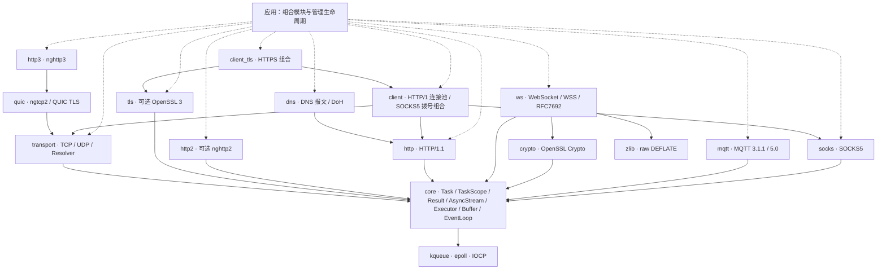

<div align="center">

# 🌐 Mira

**C++23 协程网络库 · 传输为基，协议其上** · TCP / UDP / TLS / WebSocket / HTTP/1.1 / HTTP/2 / QUIC / HTTP/3 / SOCKS5 / DoH / MQTT

一套完成式 I/O 接口连接 kqueue、epoll 与 IOCP，让协议不必认识套接字。

[](https://en.cppreference.com/w/cpp/23)
[](LICENSE)
[](https://github.com/dqsjqian/Mira/actions/workflows/ci.yml)
[](https://github.com/dqsjqian/Mira/releases/latest)
[](#-平台矩阵)

[English](README.en.md) | 简体中文

</div>

---

> *Mira* —— 网络软件的这一层基础：持续在底层托住所有协议与业务，不是又一个包办一切的 HTTP 框架。

**完成式 I/O 一个接口打通 kqueue / epoll / IOCP；从 TCP 到 HTTP/3，验证按提交与配置记录。C++23 是基线，不是卖点 —— 协程、`std::expected`、`stop_token` 都是一等公民。**

本页描述所在提交的能力。源码版本、兼容策略和发布包消费方式统一见[版本与发布指南](docs/RELEASES.md)；历史 CI 与当前提交的验收结果分别记录。

## 🚀 30 秒看懂 Mira

一个 TCP echo，就是整个库的世界观：**你 `co_await` 一个完成，库负责跨平台**。

```cpp
Mira::Task<Mira::Result<void>>
echo_tcp(Mira::transport::tcp::Socket& socket) {
    std::array<std::byte, 4096> buffer{};
    for (;;) {
        auto read = co_await socket.read_some(buffer);   // kqueue/epoll/IOCP 都长这样
        if (!read) {
            if (read.error() == Mira::Errc::eof) co_return Mira::Result<void>{};
            co_return Mira::fail(read.error());
        }
        auto written = co_await Mira::write_all(
            socket, std::span<const std::byte>{buffer}.first(*read));
        if (!written) co_return Mira::fail(written.error());
    }
}
```

HTTP 服务长同一个样子 —— 处理函数是模板自由函数，**换成 TLS 流，代码一个字不用改**：

```cpp
template<Mira::AsyncStream Stream>
Mira::Task<Mira::Result<void>> hello(
    const Mira::http::Request&,
    Mira::http::ResponseWriter<Stream>& writer,
    std::span<const std::byte>) {
    Mira::http::Response response;
    response.status = 200;
    response.headers.append("Content-Type", "text/plain; charset=utf-8");
    std::string_view body = "hello, Mira\n";
    co_return co_await writer.send(response, {
        reinterpret_cast<const std::byte*>(body.data()), body.size()});
}

// TCP 上：co_await Mira::http::serve_connection(socket, &hello<tcp::Socket>);
// TLS 上：co_await Mira::http::serve_connection(tls_stream, &hello<tls::Stream<tcp::Socket>>);
```

## 🎯 为什么是 Mira

| 设计抉择 | 一句话 |
|---|---|
| **网络库，而非兼容层** | 独立设计，不以兼容任何既有 HTTP 库或宿主框架为目标 |
| **等待完成，而非等待就绪** | `co_await read_some(buffer)` 返回读取结果；就绪/完成的平台差异留在后端 |
| **组合，而非绑定** | 协议只认 `AsyncStream`；TLS 不硬编码 HTTP，HTTP 不依赖 OpenSSL |
| **错误与边界说清楚** | `Result<T>` = `std::expected<T, std::error_code>`；取消、截止时间、资源上限是设计标准 |

不以功能数量或未测量的性能排名定义质量。先把生命周期、跨平台语义和协议正确性做扎实，再扩展能力。

## 🏗 模块架构



实线是依赖方向，虚线是应用层组合。HTTP 与 TLS 通过 core 的流契约工作，**不直接依赖 TCP 模块**：运行时可以组合 HTTP → TLS → TCP，也可以是自定义流协议 → TCP。

| 模块 | 职责 |
|---|---|
| `Mira::core` | 协程与任务作用域、流与执行器接口、有界投递、独立线程 `LoopGroup`、共享资源预算 |
| `Mira::transport` | TCP/UDP、本地流、有界系统解析器、交错候选 `tcp::dial`、受管服务生命周期 |
| `Mira::tls` | 同事件循环全双工 TLS 流、独立请求期限、证书与主机名验证、mTLS、多协议 ALPN |
| `Mira::ws` / `Mira::crypto` | WebSocket/WSS、子协议、RFC7692 有界压缩、安全 nonce/mask、Extended CONNECT 字段协商 |
| `Mira::http` | HTTP/1 解析、序列化、单连接服务、流式请求/响应、`Expect: 100-continue` 双工交换；仅依赖流契约 |
| `Mira::client` / `Mira::client_tls` | HTTP/1 / HTTPS 池与 SOCKS5 组合；可选 `client_http2` / `client_http3` 拥有式多路客户端，显式关闭并 join 生命周期 |
| `Mira::http2` | 可选 nghttp2 Session、多流、Extended CONNECT 与 `ConnectStream` |
| `Mira::quic` / `Mira::http3` | QUIC v1、显式迁移/会话恢复、nghttp3/QPACK、Extended CONNECT、HTTP/3 0-RTT（票据域绑定 SETTINGS） |
| `Mira::socks` | SOCKS5（RFC 1928/1929）客户端与代理握手，按报文精确读长，跑在任意有界流上 |
| `Mira::dns` | DNS 报文编解码（RFC 1035/6891，含 EDNS(0)）与 DoH 映射（RFC 8484） |
| `Mira::mqtt` | MQTT 3.1.1/5.0 全报文编解码、无套接字客户端 `Session`、双工 `Client<Stream>` |

分层由 `scripts/ci/check_layering.py` 强制检查：禁止反向依赖与宿主框架头文件，平台识别集中在 `platform.hpp`，协议模块不包含 OS 头文件。

## 📖 API 速览

<details>
<summary><b>TaskScope：结构化并发，显式生命周期</b></summary>

```cpp
Mira::Task<int> count_after_delay(Mira::EventLoop& loop) {
    int count = 0;
    Mira::TaskScope scope;
    scope.spawn(delayed_increment(loop, scope.get_stop_token(), count));
    co_await scope.join();          // 等所有子任务清完才返回
    co_return count;                // count 就在父帧里，不会悬空
}
```

- `join()` 只能调用一次，调用即关闭接纳；第一个子任务异常触发 `request_stop()`，join 收齐后重抛
- 用过未 join 的 scope 析构会 `std::terminate()` —— 这是 fail-fast，不是隐式清理
- await 空 `Task` 抛 `std::logic_error`；传空任务抛 `std::invalid_argument`
- 循环等待立即完成的 `Task` 使用常量原生栈，包括 GCC Debug；任务切换线程时，完成与父协程恢复通过原子交汇同步
</details>

<details>
<summary><b>取消与截止时间：给单个操作加预算</b></summary>

```cpp
co_return co_await loop.read(handle, into,
    {.stop    = std::move(stop),
     .deadline = Mira::EventLoop::Clock::now() + 5s});
```

| 情形 | 结果 |
|---|---|
| 提交时 token 已 stop | `Errc::cancelled`，不提交 |
| 提交时已过截止时间 | `Errc::timed_out`，不提交 |
| 两者同时命中 | `cancelled` —— 显式请求压过被动耗尽 |
| 同批既有真实完成又有取消/超时 | 真实完成优先 |

**绝对时间点，不是时长**：交给 `tls::Stream` 的 `{.deadline = T}` 由该请求独立的事件循环定时器管理，握手或一次读写共享这一绝对期限。底层密文 I/O 不携带请求 deadline，不会为了更新期限而取消、重放密文操作。请求到期或取消会令整个 TLS 会话失效并唤醒另一方向，且在返回前排空相关操作。取消不回滚已发生的 I/O；IOCP 上被取消的读可能丢弃内核已搬运的字节，该连接不能复用。
</details>

<details>
<summary><b>TLS：验证、ALPN 与 mTLS</b></summary>

```cpp
// 服务端：证书 + 私钥，可选强制客户端证书（mTLS）与最低协议版本
auto ctx = Mira::tls::Context::server({
    .cert_file = "server.pem", .key_file = "server-key.pem",
    .client_ca_file = "ca.pem",      // 非空 = 强制 mTLS
    .min_version = "1.2",            // "1.2" / "1.3"
});

// 客户端：验证证书链与主机名；可选出示客户端证书
auto client = Mira::tls::Context::client({
    .ca_file = "ca.pem", .cert_file = "client.pem", .key_file = "client-key.pem",
});
```

- `tls::Stream<T>::create(loop, transport, ctx, "localhost")` → `co_await stream.handshake()` → 正常读写
- 无不安全的验证绕过开关；TLS 1.0/1.1 永远被拒绝
- ALPN 协商后必须检查 `negotiated_protocol()` 再选择 H1/H2 —— 库不自动切换协议
</details>

<details open>
<summary><b>HTTP：两个时长，而不是一个截止时间</b></summary>

`ServerOptions` 收 `idle_timeout`（请求之间的空等）与 `request_timeout`（首字节到响应写完），`serve_connection` 每轮换算成新的绝对时间点 —— 第 100 个 keep-alive 请求和第 1 个享有同样预算。

| 何时到期 | 结果 |
|---|---|
| 请求之间空等超时 | **成功**返回 —— 安静连接被关掉是它正常的结束方式 |
| 请求进行中超时 | `Errc::timed_out` 并关闭连接 |

不发 408：宣告超时就得再要一份调用方从未授予的预算。两个窗口默认关闭，公网服务应当显式设置。
</details>

## 📋 平台矩阵

| 平台 | 后端 | 验证范围 |
|---|---|---|
| macOS | kqueue | 基础/TLS/H2/H3 运行测试、ASan/UBSan、独立 HTTP/3 curl 与 Retry 互操作 |
| Linux | epoll | GCC/Clang 运行测试、GCC ASan/UBSan、独立 HTTP/3 curl 与 Retry 互操作 |
| Windows | IOCP | MSVC/MinGW 原生基础/TLS/H2/H3 测试；MSVC 独立 HTTP/3 curl 与 Retry 互操作 |
| iOS | kqueue | 宿主 smoke 与无签名交叉编译通过；缺少签名 profile，未完成真机运行 |
| Android | epoll | 非 TLS 模块交叉编译，需 **NDK 29+**；无真机运行证据 |

CI 同时覆盖安装包消费与依赖隔离、协议模糊测试、MQTT/mosquitto 互操作，以及包含压缩的官方 Autobahn 客户端/服务端测试。Linux、macOS 和 Windows MSVC 的协议任务均要求独立 HTTP/3 与 Retry 互操作成功；sanitizer 等缺少独立 HTTP3 curl 的配置将相应用例计为跳过。

每个发布版本在 [Release](https://github.com/dqsjqian/Mira/releases) 中关联 CI 验证记录和源码校验和。修复与验证快照集中在[审核记录](docs/AUDIT-2026-09-30.md)，顶部 CI 徽章显示主线状态。macOS 未运行 LeakSanitizer；交叉编译不代表移动端真机验证。

## ✨ 能力全景

| 领域 | 能力 |
|---|---|
| 执行与生命周期 | 惰性 `Task`、`TaskScope` join、可靠 continuation 投递、有界应用投递、独立线程 `LoopGroup` |
| 取消与截止时间 | `OperationOptions` 贯穿 `EventLoop` → TCP → TLS → HTTP 全栈 |
| TCP | IPv4/IPv6、交错候选 `dial`、短读写、独占绑定、grace drain / cancel / join |
| UDP | IPv4/IPv6、零长数据报、截断、取消/deadline、ASM 组播；POSIX 目的地址/接口/流量类别/内核时间戳及逐包选源，未支持的平台选项明确拒绝 |
| DNS | 有界系统解析、策略正负缓存、同查询去重、独立等待者取消；独立异步 UDP/TCP DNS 查询与 DoH GET/POST、多路会话映射 |
| TLS | OpenSSL 3、证书链与 DNS/IP 验证、mTLS + 多 ALPN、SNI 多证书与原子配置更新、本地 CRL、关闭通知 |
| WebSocket/WSS | 子协议协商、分片与控制帧、UTF-8、可选 permessage-deflate、TCP/TLS 同 loop 双工 |
| 本地传输 / SSE | POSIX Unix-domain socket；基于 HTTP/1 chunked 的 SSE 与 Last-Event-ID 示例 |
| HTTP/1 | 增量解析、keep-alive、HEAD、chunked、流式上传/响应、`Expect: 100-continue` 与提前响应双工、独立 HTTP/HTTPS 池组合 |
| HTTP/2 | nghttp2、HPACK、多流、消费驱动窗口、显式 Extended CONNECT |
| QUIC/H3 | ngtcp2 + nghttp3 + OpenSSL ossl；validated migration、QUIC 会话恢复/显式 0-RTT、HTTP/3 0-RTT（0.5-RTT 应答、拒绝后同流 ID 重提、不安全方法自动 425）、QPACK、Extended CONNECT、两阶段 GOAWAY |
| SOCKS5 | CONNECT、BIND 两次响应、UDP ASSOCIATE 与有界无分片 UDP 封装；用户名/密码、精确握手读长、目标域名不在本地解析 |
| MQTT | 3.1.1 / 5.0、QoS 0/1/2 双向流程、CONNACK 限额、主题别名、keep-alive 监督、增强认证、会话恢复重发 |
| 安全与资源 | 协议限额、有界 TLS BIO、跨 loop 预算、可选 0-RTT 反重放存储；操作追踪/指标、QUIC qlog；非进程 RSS 上限 |

`stop()` 只请求 `run()` 返回；逐操作取消是 `OperationOptions` 的职责 —— 每一层职责清晰、互不越界。

协议资源预算、取消与任务生命周期的修复及验证边界见[审核记录](docs/AUDIT-2026-09-30.md)。

生产依赖应使用包含安全修复的 OpenSSL：截至 2026-09-30，3.5 LTS 为 **3.5.9**、3.6 分支为 **3.6.5**，也可使用已回移相应修复的供应商包。仅满足 API 最低版本不代表包含这些补丁；其中 [CVE-2026-35189](https://openssl-library.org/news/vulnerabilities/#CVE-2026-35189) 可由对端 TLS 证书触发。CI 源码构建已固定到带哈希校验的 3.5.9。

## 🚀 快速开始

需要 **CMake 3.21+、C++23 编译器**。CI 工具链包括 **GCC 14+ / Clang 19+（Linux）/ AppleClang / MSVC v143**：

- **GCC 14+**：GCC 13 的协程优化器存在已知内部错误（GCC 14 修复）。
- **Linux 上 Clang 19+**：clang-18 的 `__cpp_concepts` 宏版本过旧，libstdc++ 据此隐藏 `std::expected`。

基础 core / transport / HTTP/1 构建零第三方依赖；TLS、WebSocket、HTTP/2、QUIC/HTTP/3 的可选依赖仅在启用对应模块时引入。

```bash
git clone https://github.com/dqsjqian/Mira.git
cd Mira
cmake -S . -B build/debug -DCMAKE_BUILD_TYPE=Debug
cmake --build build/debug -j
ctest --test-dir build/debug --output-on-failure
```

启用 TLS（需要 OpenSSL 3）：

```bash
cmake -S . -B build/tls -DCMAKE_BUILD_TYPE=Debug -DMIRA_ENABLE_TLS=ON
cmake --build build/tls -j && ctest --test-dir build/tls --output-on-failure
```

可选高版本协议：`MIRA_ENABLE_HTTP2=ON` / `MIRA_ENABLE_HTTP3=ON`（默认关闭，不自动联网下载；依赖版本与 SHA256 固定在 `tools/protocol-dependencies.json`）。显式依赖构建入口需要 Python 3.10+；先在同一个 Python 环境安装 `requirements-build.txt` 中固定版本的构建工具。

### 最小 client / server 示例

每行先在终端 A 启动 server，再在终端 B 运行 client。全部绑定 loopback，客户端带总 deadline、错误退出码和响应校验；不是只打印成功的伪示例。

| 协议 | 终端 A：server | 终端 B：client |
|---|---|---|
| TCP echo | `build/debug/mira_echo_server 8080` | `build/debug/mira_tcp_client 8080 hello` |
| UDP echo | `build/debug/mira_udp_server 8081` | `build/debug/mira_udp_client 8081 hello` |
| HTTP/1.1 | `build/debug/mira_hello_world_server 8082` | `build/debug/mira_http1_client 8082` |
| HTTP/2 prior knowledge | `build/protocols/mira_h2_prior_knowledge_server 8083` | `build/protocols/mira_h2_client 8083` |
| HTTP/3 | `build/protocols/mira_h3_server 8443 cert.pem key.pem` | `build/protocols/mira_h3_client 8443 cert.pem` |

UDP 客户端传 `""` 可测零字节报文。HTTP1 在同一连接执行两次 keep-alive 请求；H2/H3 提交两个不同流。H2 示例为明文 prior knowledge，不是 TLS/ALPN 示例。H3 示例是单连接多请求，不冒充按 CID 分发的多客户端 listener；生产证书和私钥由调用方管理。

构建 H2/H3（先准备 OpenSSL 3.5+，将 `OPENSSL_ROOT_DIR` 设为其安装路径）：

```bash
python3 -m pip install -r requirements-build.txt
python3 scripts/ci/build_protocol_deps.py --openssl-root "$OPENSSL_ROOT_DIR"
cmake -S . -B build/protocols -DMIRA_ENABLE_TLS=ON -DMIRA_ENABLE_HTTP2=ON -DMIRA_ENABLE_HTTP3=ON -DCMAKE_PREFIX_PATH="$PWD/build/protocol-deps/prefix" -DOPENSSL_ROOT_DIR="$OPENSSL_ROOT_DIR"
cmake --build build/protocols -j
ctest --test-dir build/protocols --output-on-failure
"$OPENSSL_ROOT_DIR/bin/openssl" req -x509 -newkey rsa:2048 -nodes -keyout key.pem -out cert.pem -days 2 -subj /CN=localhost -addext subjectAltName=DNS:localhost
```

最后一条命令仅生成本地演示用证书；客户端验证该 CA 与 `localhost`，没有关闭验证。H3 可独立开启而无需 H2/nghttp2。所有成对示例都有进程外自动测试；独立 curl 互操作与同库双端测试分开计量。

### 📦 在自己的项目中使用

版本来源、兼容策略及带 SHA256 校验的源码包消费示例统一见[版本与发布指南](docs/RELEASES.md)。选择 Release 时请阅读对应 tag 下的文档。

已校验并解压的源码可直接加入构建：

```cmake
set(MIRA_BUILD_TESTS OFF)
set(MIRA_BUILD_EXAMPLES OFF)
add_subdirectory(vendor/Mira)
target_link_libraries(my_app PRIVATE Mira::transport Mira::http)
# TLS：同时 set(MIRA_ENABLE_TLS ON) 并额外链接 Mira::tls
```

安装消费使用 `find_package(Mira REQUIRED COMPONENTS core transport http)`，需要 TLS 时加 `tls` 组件；精确版本由消费方的依赖锁定文件指定，见统一指南。

拥有式客户端组合使用 `find_package(Mira REQUIRED COMPONENTS client)` / `Mira::client`；HTTPS 使用 `client_tls` / `Mira::client_tls`，构建时需 `MIRA_ENABLE_TLS=ON`。基础 `client` 不引入 OpenSSL；`http` 本身仍不依赖 transport。协议组件 `socks`、`dns`、`mqtt` 对应 `Mira::socks` / `Mira::dns` / `Mira::mqtt`，均不引入 OpenSSL，TLS 由调用方组合。

Android 需 **NDK 29 或更新**：NDK 27/28 的 libc++ 把 `std::stop_token` 门控关闭了；NDK 29（clang 21）在 API 24 上实测可构建。

## 已落地的生产组合能力

- **单端口多客户端 QUIC/H3**：`quic::Dispatcher` 按实际 DCID 路由（含新 CID），`http3::make_server` 组合 H3；准入、payload 与队列预留有界；默认 `fixed_peer` 拒绝来源变化，显式 `MigrationPolicy::validated` 才允许经路径验证的 migration/NAT rebinding。多个 dispatcher 可共享 `ResourceBudget`。连接终止释放应用预算，保留全部已签发 CID 至少三个 PTO；本地主动关闭按匹配入包限频重发，对端 draining 静默丢弃。关闭槽在准入时预留，不驱逐尚受保护的 CID；显式 `remove()` 才强制清除。这是可核算资源上限，不冒充进程 RSS 的硬限制，也不是完整重放/洪泛防护。
- **QUIC Retry / 来源地址验证**：向 `http3::make_server` / `quic::Listener::create` 传入 `RetryOptions{.policy = RetryPolicy::required}`，在 token 验证前不创建连接、不占连接预算。token 使用 ngtcp2 官方 AEAD，绑定地址、端口、版本、Retry CID、服务作用域与本地端点；过期、未来时间、篡改或来源变化静默拒绝。默认独立随机密钥，可显式轮转并保留一代旧密钥。`ingest().reply` 由调用方即时发送或丢弃，没有内部 Retry 队列。默认每 listener 每个固定 1 秒窗口最多 128 个 Retry，跨窗口边界可突发 256 个；这不是任意滑动秒限额或完整 DDoS 防护，也不提供一次性 token / 防重放保证。默认策略仍为 disabled，公网入口需显式 required。共享密钥要求相同作用域、本地端点、ALPN 与单调时钟基准。
- **H2/H3 出站流式 body**：`request_stream` / `respond_stream` → `write_body` → `finish_body`；预算满返回 `would_block` 且不污染连接。H3 chunk 保留到 ACK，QUIC 双向流轮转避免长流饿死短流。
- **连接生命周期**：`client::HttpClient` / `HttpsClient` 组合解析、`tcp::dial` 与每 origin 有界连接池，客户端实例及固定 TLS 配置彼此隔离；`Session::recycle()` 要求响应完全 drain、连接可复用且无留存 session task，否则拒绝。默认析构丢弃，不自动重放业务请求；`tcp::connect_with_retry` 也只重试建连。`tcp::serve(loop, ...)` 停止接入并关闭 listener，先给 `grace_period` 排空，再协作 cancel 与 join；grace 只限定何时请求取消，不保证不合作 handler 的返回时限。
- **WebSocket/WSS**：`MIRA_ENABLE_WEBSOCKET=ON`，独立 `Mira::ws` + OpenSSL Crypto（安全 nonce/mask、RFC6455 SHA-1 握手）+ zlib；分片、增量 UTF-8、ping/pong/close、消息限额、双向独立互操作。TCP 和 TLS/WSS 均支持同一事件循环上一读一写并行，握手与关闭独占；每个 TLS 请求有独立期限，取消或超时令整个 TLS 会话永久失效并唤醒同伴，不取消后重放密文。`Stream::create` 显式接收事件循环，`close()` 终止包装器但不拥有底层流。支持可选子协议协商与 permessage-deflate，并可经显式协商的 H2/H3 Extended CONNECT 承载；隧道适配器的并发契约与 TCP/TLS 双工不同，见下文。
- **SSE / 本地流**：`mira_sse_server` 演示 chunked SSE、事件 ID 与 Last-Event-ID 恢复；`transport::local` 提供 POSIX filesystem Unix-domain socket，Windows 显式 `not_supported`，不自动删除调用方路径。
- **HTTP/3 0-RTT**：两端 `EarlyDataPolicy::replay_safe`。持票客户端创建即 `early_ready()`，GET/HEAD/OPTIONS 整体请求随 0-RTT 发出；服务端接受后在握手完成前以 0.5-RTT 应答，实测一个往返完成。服务端拒绝时，TLS 保证其未处理任何早期数据，引擎按原顺序重提安全请求并复现相同流 ID，调用方只看到一次正常响应。早期请求在事件上带 `early_data` 标记，不安全方法由引擎直接答 `425 Too Early` 且不上交应用。票据域通过 `early_data_context` 绑定服务端 SETTINGS，SETTINGS 不一致的服务端无法创建。可显式共享有界 `MemoryReplayStore` 或注入原子认领存储，默认仍要求应用可安全重放，详见下文。
- **HTTP/1 `Expect: 100-continue` 与双工上传**：`ClientConnection::exchange` 边上传边读取 1xx/最终响应；先等 100、最终响应或 `continue_timeout`，中途收到 ≥300 或关闭即停发剩余 body，提前 2xx 且保持连接则允许上传完成；进行中的写不会为提前响应被取消（TLS 下取消会毁掉会话）。服务端对缓冲 handler 立即答 100，流式 handler 首次读取时答 100，拒收时关闭而不排空，未知期望答 417。
- **SOCKS5 / DoH**：`Mira::socks` 为 CONNECT 客户端与代理提供 RFC 1929 认证与严格地址处理，`client::dial_via_socks5` 一个 deadline 贯穿拨号与握手；`Mira::dns` 以“字节皆不可信”解码 DNS 报文，DoH 双向映射 GET/POST，`doh::query` 可跑在 HTTP/1 over TLS 上。示例与 curl、独立 Python 对端互通。
- **MQTT 3.1.1 / 5.0**：编解码器覆盖全部 15 种报文与两种角色，绝不编出自身解码器会拒收的字节；`Session` 无套接字实现 QoS 1/2 收发、CONNACK 限额、入站主题别名、PINGRESP 监督、增强认证与按原顺序重发的会话恢复；`Client<Stream>` 借用调用方的流，一个读者与串行写者并发，`keep_alive(loop)` 是定时写者，不依赖会毁掉 TLS 会话的读超时。`mira_mqtt_client` 与独立 Python broker 及 mosquitto 互通，CI 强制 mosquitto 用例并对编解码器做模糊测试。

```bash
cmake -S . -B build/ws -DMIRA_ENABLE_WEBSOCKET=ON -DMIRA_ENABLE_TLS=ON
cmake --build build/ws -j
ctest --test-dir build/ws --output-on-failure
# 两个终端分别运行：mira_ws_server 8080 / mira_ws_client 8080
# SSE：mira_sse_server 8081；客户端 GET /events
# 多客户端 H3 + Retry：mira_h3_multi_server cert.pem key.pem 8443 --retry
# SOCKS5：mira_socks5_server 1080 / mira_socks5_client 1080 example.com 80
# DoH：mira_doh_client 1.1.1.1 443 example.com AAAA
# MQTT（本机 mosquitto -p 1883）：mira_mqtt_client 127.0.0.1 1883 echo mira/demo hello --qos 2
```

真实网络基准：`python3 scripts/bench/network_bench.py --server build/release/mira_managed_echo_server --clients 8 --requests 1000 --slow-clients 4`，输出吞吐、p50/p99、峰值 RSS 采样和环境 JSON。负载发生器使用独立进程 Python sockets；loopback 数字不是跨库性能排名，也不是公网性能。

### 生产组合补充（主线，尚未单独发布）

- **并发 H2/H3**：`SessionDriver` 以独立收发任务和 QUIC 到期任务驱动同一连接；`ClientSession` 提供有界并发请求。`client::Http2Client` / `Http3Client` 提供每 origin 独立的拥有式多路连接池，分别通过 `Mira::client_http2` / `client_http3` 消费；H2 严格 ALPN=h2，H3 使用固定 peer 的 1-RTT 建连，不自动重放业务请求。`client::Http2Client` / `Http3Client` 拥有每 origin 的传输/安全/会话对象，同源建连去重，`max_origins` / `max_active` 满时显式背压；分别链接 `Mira::client_http2` / `Mira::client_http3`，不隐式降级或重放业务请求。单流取消不取消共享 TLS 读取。`ConnectStream` 搭配该驱动支持一读一写并发；原有自定义 driver 仍保持独占契约。先结束业务任务，再 `stop()` / `join()`，不能析构仍在运行的驱动。
- **TLS 生产配置**：精确 SNI 多证书路由、完整配置的 mTLS+多 ALPN、`reload_server` 原子发布新快照；每个域/每一代票据隔离。可选本地 CRL 与 OCSP stapling/严格客户端状态校验，不自动联网获取。默认仍是 OpenSSL trust，不冒充原生 Keychain/Windows 信任策略。
- **解析与 UDP**：系统 Resolver 增加有界正负策略缓存和同查询去重；`dns::query_udp/query_tcp` 是无需后台线程的专用连接查询，TCP fallback 由调用方显式组合。UDP 支持 ASM 组播和 POSIX 包元信息/逐包选源；Windows 非空 ancillary 选项明确不支持。
- **QUIC**：显式 PMTUD、UDP payload 上限与 Cubic/Reno/BBR 选择；RFC 9221 DATAGRAM（不是 H3 DATAGRAM/WebTransport）、有界接收丢弃、qlog 与连接统计。`ReplayStore` 可原子认领早期 ClientHello，内置共享 `MemoryReplayStore` 容量满即拒绝早期数据、不驱逐活跃记录；内存保护不等于跨进程/重启持久防重放。
- **协议组合**：`ws::ByteStream` 支持 MQTT 等二进制流协议；MQTT checkpoint/restore 带版本、client ID、调用者 scope 和过期处理，磁盘原子持久化与业务事务由应用负责。SOCKS5 新增 BIND 双响应、UDP ASSOCIATE 及严格 UDP 封装，分片明确不支持。`dns::doh::query_multiplexed` 可组合 H2/H3 客户端。
- **可观测性**：`observe` / `ObservedStream` 输出关联 ID、完成状态、时延与字节数；`OperationMetrics` 提供跨 loop 原子计数和固定桶延迟分布，不记录负载或凭据，不强制引入日志/遥测供应商。

独立 aioquic 客户端→Mira 服务端已实测 H3、0-RTT 接受/拒绝回退和 WebSocket Extended CONNECT；`scripts/ci/check_h3_aioquic.py` 可复现。30 分钟、16 客户端的故障注入快照完成 116,480/116,480 请求，87,360 个短流在慢响应重叠时完成，最终资源计数归零。上述均为明确配置下的 loopback 证据，不是所有未来提交、WAN 或全球性能排名。

### 主线 API 的使用边界

- **QUIC 路径与早期数据**：validated 模式必须使用带 `quic::Path` 的 `receive` 与 `poll_datagram` / `close_datagram`；客户端 `initiate_migration()` 发起验证，应用须保留验证期间所需的两条路径并按返回路径发送。CID 命中不等于通过地址验证。有界内存 `SessionCache` 限制条目、字节、单 ticket 大小与存活期，`ServerContext` 显式共享服务端 ticket 域。普通 `open_stream` / `write` 不发送早期数据；只有 `EarlyDataPolicy::replay_safe` 加 `open_early_stream` / `write_early` 才尝试原始 QUIC 0-RTT。调用方负责保证操作可安全重放；默认不提供反重放保证，显式共享 `ReplayStore` 的保证范围见下文，原始 QUIC 层拒绝后不自动重放。HTTP/3 0-RTT 的契约见下文专节。
- **拨号与上传**：`tcp::dial` 对解析后的去重候选交错 IPv4/IPv6，在总 deadline 内错峰、有界并发建连，返回前取消并 join 落败尝试；系统 `getaddrinfo` 仍在线程池完成，不是独立异步 A/AAAA 查询。HTTP/1 `begin` → `send_body` → `finish` 支持 content-length/chunked 上传、逐块背压与贯穿上传/生产者停顿/响应的预算；这一组是 **send-first**；需要 `Expect: 100-continue` 或上传同时读取提前响应时改用双工 `exchange`，它要求流允许一读一写同时在途（Mira TCP/TLS/本地流均满足），既不读也不关闭的对端仍由 deadline 或 stop 兜底。
- **执行与预算**：`EventLoop::post` 保留可靠 continuation 通道；应用准入走 `try_post` / `BoundedExecutor`，满额返回 `would_block`，后者故意不满足 `Executor`。投递配额在调用前释放，不约束回调新建的异步任务。`LoopGroup` 每 worker 拥有独立线程亲和 loop，配额覆盖排队及未完成根任务；socket 必须在所属 worker 创建/使用，不迁移已关联 socket。共享 `ResourceBudget` 是计量配额，不覆盖全部分配器、第三方状态或进程 RSS。
- **TLS 管理服务示例**：同时启用 TLS/H2 后运行 `build/protocols/mira_https_managed_server cert.pem key.pem 8444 64 16 5000 1000 1000`。它分别限制连接/握手、设置握手 deadline、按协商后的 ALPN 分发 H1/H2、拒绝缺失/未知 ALPN，并演示 grace drain / cancel / join；每连接处理一个 H1 请求或一批 H2 请求，不是通用生产服务器。

QUIC 会话恢复与 0-RTT 要求显式 `ca_file`：缓存键绑定 OpenSSL 实际加载的信任材料摘要（证书、AUX 信任/拒绝用途及 CRL），同路径更换 CA 或信任属性不能复用旧票据。摘要直接取已加载 store，不二次读取路径。`ca_file` 为空时默认系统信任可能包含懒加载来源，因此不保存或恢复票据，只进行完整认证握手；已有连接不会被文件变更追溯撤销。

### H2/H3 Extended CONNECT

在 `http2::Limits` / `http3::Limits` 中显式设置 `enable_connect_protocol = true`；客户端须等实际对端 `SETTINGS_ENABLE_CONNECT_PROTOCOL`，再以 `request_stream` 提交 `:method = CONNECT`、`:protocol`、`:scheme`、`:authority`、`:path`。服务端以 `respond_stream` 接受，只有成功的 2xx 才成为隧道；**204 返回 `not_supported`**，因为当前固定版本的引擎依赖把它视为无 body。普通 CONNECT 代理不在此能力范围。

`http2::ConnectStream<Driver>` / `http3::ConnectStream<Driver>` 借用已接受流；driver 的 `progress(OperationOptions)` / `flush(OperationOptions)` 必须串行驱动连接并遵守取消与 deadline。**自定义 legacy driver 同时只允许一个操作；内置 `SessionDriver` 允许一读一写并发且独占连接收发调度**，跨流调度和对象/缓冲区存活由调用方负责，不能混用直接 body 操作；`finish()` 半关闭本地输出，`close()`/取消仅 reset 该流，不保证底层 driver 的连接级故障只影响单流。

WebSocket 用 `extended_connect_request` / `accept_extended_connect` / `validate_extended_connect` 校验字段并协商子协议与 PMD，再把 `Negotiated` 交给 `Connection::adopt_extended_connect`；不执行 HTTP/1 Upgrade 或 nonce 握手。`ws.connect_network` 最新实跑 TCP H2 / UDP H3 × 压缩关闭/开启共 4 场景通过。该用例是同库真实网络证据，已移除首个 Initial flight 丢包设置，不能作为 PTO 恢复证据。独立 `scripts/ci/check_h3_aioquic.py` 使用不同 QUIC/TLS/QPACK 引擎，另行验证 H3、0-RTT 接受/拒绝回退和 WebSocket Extended CONNECT 的二进制/ping/close；当前方向为 aioquic 客户端到 Mira 服务端，不能推论反向或所有第三方实现。

### WebSocket 子协议与压缩

向 `ws::Connection` 的第四个构造参数传入 `HandshakeOptions`：`subprotocols` 指定有序协议列表，服务端按自身偏好选择交集；`require_subprotocol` 可要求必须达成协商。握手后用 `subprotocol()` 读取选择结果。协议名大小写敏感，客户端拒绝未提议协议、多重选择和重复响应头。

`compression.enabled = true` 才提议/接受 RFC7692 permessage-deflate，默认关闭。支持双向 context takeover、no-context-takeover、窗口协商、压缩分片与穿插控制帧；`read_frame` / `read_message` 返回已解压明文，文本在解压后增量验证 UTF-8。`Limits::max_frame` 同时约束 wire 帧及该帧解压输出，`max_message` 分别约束压缩累计与明文累计。发送窗口支持 9–15，接收支持 8–15；zlib 无法可靠发送 8 位窗口，协商不虚报该能力。压缩状态按方向独立，错误后不再复用。

`compression_parameters()` 返回 wire 协商结果；客户端仍在本地遵守 offer 中更小的窗口及 no-context 承诺。压缩会引入大小侧信道，不应在同一压缩上下文混合秘密与攻击者可控内容；敏感数据默认保持压缩关闭。启用 ws 构建需要 zlib，但基础模块和只用 Crypto 的安装消费不强制查找 zlib。

独立 Python socket/zlib 双向互操作：`python3 scripts/ci/check_ws_interop.py --extensions-peer build/ws/mira_ws_extensions_peer`。官方 Autobahn 客户端/服务端完整压缩模式以 `run_autobahn.py --compression` 启动，CI 拒绝失败、NON-STRICT 和缺失用例。INFORMATIONAL 单独计数；具体提交的结果与完整报告见[审核记录](docs/AUDIT-2026-09-30.md)。

### HTTP/3 0-RTT

```cpp
// 服务端：ServerContext 创建前绑定本端 H3 SETTINGS，票据域与 SETTINGS 一一对应
Mira::http3::Limits limits;
server_options.service_scope = "api";
server_options.early_data = Mira::quic::EarlyDataPolicy::replay_safe;
server_options.early_data_context = Mira::http3::early_data_context(limits);
server_options.server_context = Mira::quic::ServerContext::create(server_options).value();

// 客户端：显式 ca_file + 同一 SessionCache；持票时 connect 不发包即返回
client_options.service_scope = "api";
client_options.session_cache = cache;
client_options.early_data = Mira::quic::EarlyDataPolicy::replay_safe;
auto h3 = co_await H3::connect(loop, client_options, limits, io);
auto get = co_await h3->request(get_fields);             // 安全方法：随 0-RTT 发出
auto post = co_await h3->request(post_fields, body, io); // 其他：先完成握手（受 io 约束）再 1-RTT
```

客户端不记忆服务端 SETTINGS，早期请求一律按默认值（QPACK 动态表 0、无 Extended CONNECT），RFC 9114 §7.2.4.2 允许且任何合规服务端都能接受。兼容性判断落在服务端：`http3::Engine::create` / `make_server` 拒绝 SETTINGS 与票据域不一致的配置，而其他 `ServerContext` 签发的票据本就无法解密。服务端应用对带 `early_data` 的安全方法请求仍须自行判断能否执行两次（RFC 8470，不能则答 425）；未配置 `ReplayStore` 时，截获的 0-RTT 首包可被重放到共享票据域的任一服务端；配置时所有共享票据域的实例须使用同一原子存储，内置内存实现不跨进程、不跨重启保留。

### MQTT

```cpp
Mira::mqtt::ClientOptions options;                        // 默认 5.0；options.version 可选 v311
options.client_id = "sensor-7";
options.keep_alive = 30;
auto client = co_await Mira::mqtt::Client<tcp::Socket>::connect(socket, options, io);
auto sub = co_await client->subscribe({{"sensors/+/temp", Mira::mqtt::QoS::at_least_once}});
auto granted = co_await client->wait_for(*sub);           // SUBACK，其余事件留给 receive
auto id = co_await client->publish("sensors/7/temp", payload, Mira::mqtt::QoS::exactly_once);
auto events = co_await client->receive();                 // 消息、发布完成、服务端 DISCONNECT……
// keep_alive(loop) 是定时写者：与 receive 在同一 loop 并发，TLS 下同样安全
```

流由调用方拥有并在客户端之后销毁；客户端从不关闭它。超出服务端 Receive Maximum、包标识耗尽或输出预算满时返回 `would_block`，不暗中排队；对端违规时 5.0 以带原因的 DISCONNECT 关闭会话。收到的 QoS 1 消息在上交时即确认。断线后在新流上 `reconnect`：`clean_start = false` 且服务端报告会话仍在时，未确认的 PUBLISH（DUP）与 PUBREL 按原顺序重发，否则以 `discarded` 事件报告。可通过 `ws::ByteStream` 承载 MQTT over WebSocket，`checkpoint/restore` 保存恢复 QoS 状态；不含 broker、出站主题别名、磁盘存储后端与自动重连策略。快照不是 WAL，也不保证应用事务 exactly-once。

### Retry 真实 UDP 故障验收

启用 `MIRA_ENABLE_HTTP3=ON` 与 `MIRA_BUILD_BENCH=ON` 后，可复现有界丢包、重复、延迟、重排与连接 churn：

```bash
python3 scripts/bench/run_h3_soak.py --binary build/protocols/bench/bench_h3_soak \
  --duration-seconds 600 --seed 20260929 --output build/h3-soak.json
```

每轮验证二进制内容、慢响应期间新短流的进展、关闭保护槽与最终预算归零；超时或内容错误非零退出。默认是 3 客户端、每轮各 4 条流，128 KiB 大 body 经 16 KiB 协议缓冲流式传输。固定 seed 固定故障选择策略，不保证实际调度或随机 CID 逐包一致；这是单机 loopback 持续验收，不是多机或长时稳定性认证。初始正常关闭包不注入故障，RSS 仅采样不设硬上限。运行期间需保持机器唤醒，合盖休眠导致的超时仍判失败。

已记录的 600 秒报告 `build/all-main/sustained-600.json`：13,548/13,548 请求成功，10,161/10,161 短流在慢响应重叠期间完成；最终 connections、routes、tombstones、queued_bytes、reserved_payload_bytes 均为 0。报告为单机真实 UDP loopback，不代表多机/WAN、所有后续源码或进程 RSS 硬上限。

## 接下来：仍需验证的边界

1. iOS 已通过宿主 smoke 和无签名交叉编译，真机缺签名 profile；Android 真机尚无证据。MinGW 已有 H2/H3 与独立 curl 互操作运行证据，但该任务不单独构建固定来源的 curl；Windows MSVC 的严格互操作任务会构建它。
2. 更长时故障注入、真实多机/WAN 与进程内存硬上限仍待验。单机 loopback 和有限时长的 fuzz/soak 不代表这些边界已覆盖。
3. aioquic→Mira 的 H3 0-RTT 接受/拒绝及 WebSocket Extended CONNECT 已有独立协议栈实测；反向角色、更多实现及真实 WAN 矩阵仍待扩展。内置防重放存储限同进程共享，分布式持久化后端未交付。Retry 不保证 token 一次性使用，listener 不是互联网抗洪泛系统。
4. 客户端记忆服务端 SETTINGS、原生系统信任、Windows UDP ancillary、SSM 组播及自动 DNS fallback 等仍开放。io_uring/内核零拷贝/定制分配器按真实瓶颈选择，不以功能名代替性能证据。gRPC/Redis/WebRTC 保持生态层边界。

设计依据与验收要求见[架构文档](docs/ARCHITECTURE.md)。

## 🤝 贡献

欢迎从一个可复现问题、一条明确契约或一个针对性测试开始。修改请保持模块单向依赖，说明所有权与平台差异，并运行相关测试与 `scripts/ci/check_layering.py`。性能改进请附可复现的环境与测量方法。

## 🙏 致谢

- [nghttp2](https://github.com/nghttp2/nghttp2) —— HTTP/2 引擎（可选）
- [ngtcp2](https://github.com/ngtcp2/ngtcp2) / [nghttp3](https://github.com/ngtcp2/nghttp3) —— QUIC / HTTP/3 引擎
- [OpenSSL](https://www.openssl.org/) —— TLS 1.2/1.3 与 QUIC TLS（可选）

## 📄 License

[MIT](LICENSE) © 2026 Mira contributors

MIT 适用于 Mira 自有代码；第三方组件保留各自许可证。依赖清单、嵌入代码归属及再分发要求见[第三方许可说明](THIRD_PARTY_NOTICES.md)。

---

<div align="center">

**📖 其他语言**

[English](README.en.md)

</div>
